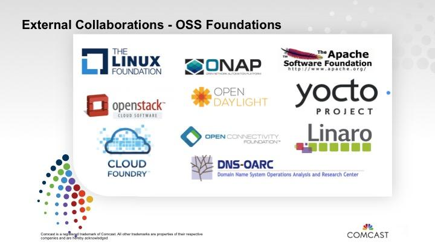

# Open Source Program Offices (OSPO) And Your Organization

## Introduction

### Section Overview

In this section, we will provide a definition and explanation of what an OSPO consists of and information on the role and value of this construct in helping effectively manage open source at scale.

### Learning Objectives

By the end of this section, you should be able to:

* Define what an Open Source Program Office (OSPO) is
* Explain the role an OSPO plays in your organization
* Articulate the value that an OSPO brings to the enterprise

## Definition

### What is an Open Source Program Office?

As mentioned in the introductory text above, an Open Source Program Office (OSPO) is intended to be the central nexus of your organization’s work with open source.  However, that definition leaves (on purpose) a lot of room for variability.  Some might say that diminishes the value, but, in fact, the fact that OSPO’s can and do look different depending upon your organization is actually a strength, as it lets you mold this construct (and change it frequently) to address a variety of needs you’ll likely have on your open source journey.

For example, some organizations centralize the majority of their upstream open source work inside their OSPO, which authorizes specific developers to work on behalf of the organization and propose upstream project changes required for downstream product enablement.  However, in some organizations, those developers are decentralized and embedded within product development teams and are advised and trained by OSPO personnel.

There is no ‘one-size-fits-all’ model, and an OSPO can be anything from highly-centralized with a large set of resources, to small and decentralized, relying on influence and training of resources throughout the organization.  A great overview resource for what an OSPO is can be found in the work of the TODO Group in their [github repository](https://github.com/todogroup/ospodefinition.org).

### Functions of an OSPO in the Enterprise

An open source program office’s main functions are to advance open source consumption, contribution, and creation inside companies for strategic advantage.

The responsibilities of a program office are varied. These include:

* Clearly communicating the open source strategy within and outside the company
* Owning and overseeing the execution of the strategy 
* Facilitating the effective use of open source in commercial products and services
* Ensuring high-quality and frequent releases of code to open source communities
* Engaging with developer communities and seeing that the company contributes back to other projects effectively
* Fostering an open source culture within an organization
* Maintaining open source license compliance reviews and oversight

It’s important here to reiterate that not all OSPOs have all of these functions, or necessarily have even distribution of what things they work on.  A large part of what the program office does is dependent on what the organization’s business needs are.

One thing that should be stressed is that OSPOs do more than just work with developers - they have a host of non-development activities that they can assist with, as noted below:

Credit: TODO Group OSPO Guides ([https://todogroup.org/guides/](https://todogroup.org/guides/))

### The Value of an OSPO

A successful office can greatly benefit corporate open source use by establishing policies, processes and guidelines that enable developers and their teams. It encourages standard coding and organizational practices, processes, and toolsets. At the same time, a program office can help avoid or remove unneeded, rigid processes which creative developers may circumvent or ignore anyway, threatening security and other aspects of projects.

An open source program office brings substance and facts to the conversation when business units begin to consider open source in their plans so there is a full understanding of why it is being considered, what the consequences will be, and what is needed to reach its goals. By having specialists in open source help frame the conversation, stakeholders know where to start and what to think about as they weigh their decision.

The program office also acts as a critical liaison between internal developers and the open source user communities to resolve and understand issues or requirements that arise. The program office can assist with legal issues, provide developer advocacy, and act as a voice for external users who are building on a company’s open source projects. The program office can also help relay that information to others inside the company, including the product management team, to further advance products in a way that is beneficial to the organization. 

# Building an Effective Open Source Program Office

## Introduction

### Section Overview

In this section, we will show how to create an effective Open Source Program Office, including information on roles, governance, processes and structure.

### Learning Objectives

By the end of this section, you should be able to:

* Describe the main steps in forming a new OSPO
* Describe the different roles and structure that might be part of an OSPO
* Articulate how to build governance and other processes into an OSPO

## Establishing an OSPO

### Where to Begin?

Every company is different and will have different needs when it comes to starting an OSPO. The process can start from the top down, with buy-in from top management; or from the bottom up, where pockets of developers and open source enthusiasts have been using open source and want to see it formalized. 

It can manifest itself as a desire to create guidance around legal issues and security, or it can start as a grassroots effort that matures and attracts the attention of corporate leaders. It can even start with a forward-thinking CEO or CTO who champions the cause to drive the company forward and add value by deepening its commitment to open source. 

This kind of consensus and executive support will be essential to gain traction and move the process of starting an OSPO forward. Where you start your open source program office journey will be unique to your organization.  However, we’ll cover some critical steps that you should be thinking about in the following pages.

### Find a Leader

Regardless of how your planning starts, it’s important to find the right leader to help develop and then run the fledgling program office inside a company. The top candidate will have a detailed understanding about how open source works, along with some technical chops from working as a developer, contributor, or committer on existing open source projects. 

They should have a broad understanding of your company’s business along with the business acumen and management skills to help inform strategy and plans across business units. And they need to be sociable so they can convey enthusiasm, knowledge, and information to others and help them understand how the open source initiative is going to transform, change, and improve things for the company. 

The head of the program office needs to be able to talk with people about the deep technology, but they don’t have to know the ins and outs of every technology at play, because their main job will be to help frame the detailed discussions that will happen among multiple stakeholders.

### Define Your Operations

The budget, staffing, technology tools and systems needed by a new program office are also key issues to resolve in establishing its operations. Some companies begin with a part-time manager, but learn they will only get so far with that approach. Making the position someone’s full-time job is a solid step to get the program off the ground, along with a small support staff to keep it nimble.

An example of a well-defined open source program office is one that drives needed policy, processes and tools, while also operating with a mantra of eliminating friction where it is found, using tools to automate what can be streamlined, and delegating tasks which need to be accomplished. We’ll cover more specifics on how to set policies and processes in future sections.

A program office must offer structured policies and processes but also remain flexible. When open source users and contributors need help, the office operates more like a consultancy, providing guidance while still allowing employees to make individual or group business decisions relating to their work. 

### Seek Feedback and Buy-in

Establishing an open source program office isn’t something that should be done in a vacuum. Because it will have a central role in your business, creating it successfully will require open and honest input and feedback from all involved parties inside enterprises. Making sure that everyone from the executives to the developers have a say in its creation will help give the effort broad-based support.

Getting a handle on what your company is doing with open source requires thinking from multiple stakeholders about the core things that your organization really cares about. Seeking this feedback early on and making sure it’s fed into your rollout plans for the OSPO will go a long way toward acceptance and success of the processes and strategies the program helps define.

## Defining an OSPO Program Structure

### Where Should the OSPO Reside?

So how and where should open source program offices fit inside a company’s organizational structure? Should it be inside the engineering department? Or in the legal department, the CTO’s office or in another specific business unit? Again, that depends on your company’s primary business and your open source strategy.

Let’s reiterate here that there isn’t a ‘one-size-fits’ all answer to where your OSPO should reside. In the following pages, we’ll discuss some of the most often chosen locations for the program office, but by no means is this list exhaustive.

### OSPO as part of a Legal Group

For companies that have large intellectual property portfolios, that could mean the open source program office might be a perfect fit in the legal office, where developers can work closely with the legal team on issues that arise. That might be a good fit for a hardware company because it’s always concerned about potentially running into IP-related legal issues.

One challenge with this approach however, is that an OSPO under the legal department could end up focusing a significant portion of their time on compliance matters, thereby diminishing other opportunities to encourage open source contributions and outreach to external open source communities that can be beneficial to the organization in the long term.  If you decide to host your OSPO in the legal group, you’ll need a strong leader who can balance the compliance aspects of the group's role with more forward-thinking and strategic policies on engaging with the open source community.

### OSPO in Engineering

Companies who are more engineering-driven often choose to maintain their open source program offices within their engineering departments. That allows them to focus their efforts directly on making their developers more effective and productive in their work.

In many cases, these program offices report into the CTO or in some cases the CIO.  In organizations with a strong/connected set of products, the office can report to the VP of Product Development or VP of engineering.  In companies with disparate product portfolios, it’s usually best to house the OSPO within the office of the CTO, as this gives it the widest view and latitude in helping develop policies and education efforts for all of the engineering teams.

One downside to this approach can potentially be less of a focus on compliance activities (as compared to hosting the OSPO with the legal group), but again, a strong leader can provide the necessary balance here, and, if this is done well, it can lead to increase compliance by developers if they feel that the processes are lightweight and not onerous.

### OSPO as part of Developer Relations/Marketing

For some organizations, open source offices are located inside the marketing group because they use open source to funnel leads aimed at selling the products they build using open source. If an organization requires a close connection with key open source developers and projects, hosting the OSPO in a group like developer relations can provide this support.

Of course, the OSPO still has to be able to perform other needed roles in the compliance and education domains as necessary.

### Implementation Considerations

Another important element to consider when making the decision about where to place your OSPO in the organization revolves around whether you are planning a centralized vs. decentralized approach.

In a smaller organization, having a centralized open source program office with all workflows for consumption, collaboration and creation coming to a central location might work well.  It ensures the greatest consistency of approach and compliance, but as an organization grows, it can also become unwieldy. 

Centralized organizations sometimes also host the main developers who will contribute to upstream open source projects on behalf of the organization.  These developers often act as internal consultants for product teams who may lack the training and expertise to contribute to open source projects on their own.  

Once your organization becomes large enough though, a decentralized approach generally works best, as you can focus on educating and providing consulting resources for developers and managers to make product-specific decisions about open source that are consistent with the overall organizational policies.  This approach also spreads the open source knowledge throughout your organization and helps foster a more open and collaborative culture, which is an important trait for working with the larger open source ecosystem.

In a later section of this module, we’ll share case studies to give some examples of how other organizations have made these structural decisions.

## Lesson: OSPO Roles

### Management Roles

In creating an open source program office, decisions must be made to establish the roles and responsibilities of the open source program manager, the company’s legal team, and any review board made up of engineers and executives.  Additionally, as an OSPO grows, there may be additional roles that provide value to the organization.  In the next few pages we’ll cover these roles in more detail.

#### Program Manager

For maximum effectiveness, the program manager should be empowered as an executive-level position with direct oversight and hands-on management of the company’s interests in its open source activities. That would give them the tools they need to lead the way inside an enterprise toward its open source goals and vision.

Some companies choose to use an Open Source Executive Council, which is similar to a review board. Such a group is usually made up of senior leaders from all major business units inside the company, and provides board of directors-style guidance on policy changes and introductions, sets priorities for the open source program, and assists in driving changes in organizational behavior.

#### Legal

Like every other function inside a company, legal teams must have a say in the operations of the open source program office to ensure compliance with laws, open source licensing agreements, and other legal details. Specific to open source, the legal team needs to be responsible for ensuring that a company can consume code internally and contribute back to projects with acceptable terms.

Larger organizations should consider hiring or training a dedicated attorney to advise their open source program. But you could also use a part-time, knowledgeable staff member or outside counsel. It is often helpful to work with an attorney who is knowledgeable and experienced with open source licensing and IP as it can be a specialized, and at times baffling, legal domain relative to commercial contracts or standards.

#### Compliance Team

The open source compliance team is a cross-disciplinary group consisting of various individuals tasked with the mission of ensuring open source license compliance. The core team, often called the Open Source Review Board (OSRB), consists of representatives from engineering and product teams, one or more legal counsel, and the compliance officer (who is often the open source program manager).

The extended team consists of various individuals across multiple departments that contribute on an ongoing basis to the compliance efforts. These may include documentation, supply chain, corporate development, IT, localization and an Open Source Executive Committee (OSEC). However, unlike the core team, members of the extended team only work on compliance on a part-time basis, based on tasks they receive from the OSRB. 

#### Developer Relations, Advocacy, and Evangelists

Open source developer relations and evangelists can be important to a fledgling open source program office because they can work to build interest and enthusiasm within a company’s developer community for specific projects, which can help grow the efforts and increase teamwork among engineers. Evangelists often go to conferences and tech events and explain what open source is to help audiences understand how it can be used and what challenges and opportunities it offers, while sharing their corporate experiences with the open source community.

#### Others

In addition, the creation of other job roles is important for the success of the open source program office, including tool administrators, training managers, integration developers for tools and systems, deployment support staffers, and implementation project leads. Tool administrators, for example, are needed to help select, provide and integrate needed tools for engineers working on their open source projects, while also ensuring the tools meet the licensing and other requirements of an enterprise.

## Defining OSPO Processes

### Overview

After tackling an OSPO’s structure and staffing requirements, the next step is to develop well-defined policies and processes which will enable consistent implementation of your company’s open source strategy.

The policies should lay out the requirements and rules for working with open source across the company, as well as documented and executable processes which will ensure the rules are followed on a day-to-day basis.

Crucially, these processes should require minimal overhead and strive to repeatedly eliminate, automate and delegate when reviewing existing open source policies and processes so the rules are constantly questioned and updated to streamline procedures. That means asking why policies are even in place and how they can be improved for users.

Even as those rules are carefully created for open source program offices, companies must be prepared to evolve and modify the rules and procedures as needed over time as their businesses change and as their open source engagements mature and grow.

### Questions to Ask

When drafting open source policies & processes, among the many topics that need to be discussed are:

* How employees of your company can contribute to open source projects
* How your company can open source internal projects
* How your company accepts external contributions to their open source projects
* How to prepare for open source releases
* How approvals are received
* How developers can use open source code they find on GitHub and other code repositories
* Procedures and rules explaining how open source code can be brought into your company
* How the incoming code is catalogued so others know it is being used
* How a company can grow a community of like-minded external developers around it to keep it thriving
* Rules that help determine when code should be released as open source or kept as intellectual property

The answers to these questions help inform policies and processes going forward - we’ll cover some examples of these policies in the following pages.

### Policies for Releasing Code

An important OSPO goal is to help developers be successful in making contributions to open source projects and in releasing their own projects. Guidelines and checklists ensure that developers have everything they need to release their code as open source without running into licensing or confidentiality issues. Especially for new contributors, it can also help to have an internal review process available as a safe place to get feedback before making a contribution.

Your organization should also strive to adopt an "upstream first" development policy. By submitting patches to the upstream open source project first, and incorporating them into your own products downstream, you will avoid spending a massive amount of time and money on re-engineering after each release.

### Policies for Accepting Contributions

If you eventually create your own open source projects and they are not hosted at a neutral foundation, you’ll want to create procedures for your company to receive contributions to these projects from external developers.

That is, of course, one of the benefits of putting your company’s open source code out into other communities and inviting other developers to establish an interest in your own projects. Because in the grand scheme of things, even though they are not officially your employees, you can have brilliant people working on your company’s code from around the world, making it better and expanding its capabilities. This kind of collaboration is important for companies and is a common focus for many open source program offices.

### Policies to Promote Adoption

You also want to encourage others to use your code in their products and services. This is key to building ecosystems that in turn help grow and sustain your open source projects. Policies for open source use can come in a variety of innovative forms.

For example, Red Hat has a unique policy by defaulting to open source with its newly-created code in most cases from the start. That means that when developing each piece of software inside the company, it is assumed that in the future it may be destined to be released as open source.

Due to that scrutiny, developers tend to structure things in better ways when writing open source, creating cleaner code with fewer or improved code dependencies in their work.

### Policies for Internal Consumption

Other needed policies include rules about how and where your team finds trusted sources for open source software use and creation, policies about establishing code management and maintenance procedures, and formalizing community interaction for your projects. 

An open source usage policy ensures that any software (proprietary, third-party, or open source) that makes its way into the product base has been audited, reviewed, and approved. It also ensures that your company has a plan to fulfill the license obligations resulting from using the various software components, before your products make it to customers.

For example, your policy could require engineers to receive approval from your organization’s auditing staff, such as an open source review board (OSRB), before integrating any open source code in a product. It may also state that software received from third parties must be audited to identify any open source code included, which ensures license obligations can be fulfilled before a product ships.

### Policies for License Compliance

Also needed are policies to formalize and establish legal compliance procedures and to assure executive oversight for the program.

You’ll also want to map out how you’ll handle the software tools that will make much of the compliance and code testing work possible by automating it and streamlining procedures for developers and contributors.  More details on compliance tools will be covered in later course modules in this series.

Existing open source resources are also potential gold mines for finding other materials needed by your open source projects, including documentation for contributor license agreements (CLAs). CLAs are used to "define the terms under which intellectual property has been contributed to a company/project", typically software under an open source license. Projects that use CLAs require contributors, and often their companies, to sign the CLA before contributions will be accepted by the project.  Determining your company's policies on using and signing CLAs is an important step to consider in building your overall license compliance policy.

### Final Words

There’s a lot of work to do and much to consider when your company decides to create an open source program office, but its value will likely outweigh the efforts taken to accomplish it. Finding just the right leader to drive the program office initiative is a critical step in the process to make it a success.

It’s also important to remember that the heart of the OSPO is really a culture change endeavor. Obviously software plays a key role, but understanding your company’s current culture, and where you want to go in open source is critically important.  For all of the process and education pieces of an OSPO, the biggest realization that most organizations make is that this program, and it’s leader are really change agents within the organization.

# Additional Information & Case Studies

## Introduction

### Section Overview

In this section, we will provide some case studies of organizations that have built Open Source Program Offices, as well as give some pointers to additional information that will help you as you begin the journey to creating your OSPO for more effective open source program management.

### Learning Objectives

By the end of this section, you should be able to:

* Describe the main differences between several open source program office implementations
* Know where to go for additional information on building your own OSPO

## Case Studies

### Overview

As was mentioned earlier, every organization’s Open Source Program Office is likely to be different.  This reflects the realities both of differing business models as well as each organization’s current state of open source maturity and awareness.

In order to give a reasonably broad perspective, we’ve picked three companies and their OSPO creation journeys as case studies.  These organizations have graciously donated the time of their open source leaders and management teams to build these case studies in the hopes that they will be of use to others who are starting their journey in open source.

Our case studies are from:

* **Comcast**
* **Microsoft**
* **Salesforce**

In these studies, you’ll see different approaches to tooling, organization and even metrics.  These studies were conducted under the auspices of the TODO Group (a Linux Foundation Initiative) and we will have pointers to additional information later on in this module.

### Comcast

Comcast’s involvement in open source was a gradual process that evolved over time. The company eventually created two open source program offices, one for the NBC business and another for the cable side of the business, which is the subject of this profile.

Comcast began contributing to open source around 2006 when Jon Moore, Chief Software Architect, made a patch contribution to Apache HTTP. He showed the management team that it was more cost effective to have the patch incorporated into the main project than it was to maintain it separately.

Working with an interdisciplinary team, Moore worked to set up an open source advisory council, which consisted of legal and technical subject matter experts. They reviewed contributions and created internal guidelines focused on good open source practices and community building. In 2013, when they started tracking these contributions, they had 13. They had plans to do almost 10x more of that in 2017.

*"When companies establish open source practices they send a big message saying that we’re serious about open source and that we want to invest in it."* – Nithya Ruff, Senior Director Open Source Practice at Comcast.

#### Six C’s of Open Source Program Practice

In 2016, Comcast hired Ruff to lead an increasingly vital open source strategy. The practice has support from the highest levels of the Comcast leadership team who wanted an organization that would field questions, educate employees, and create awareness.

The open source program practice has three full-time people (as of June 2020) while relying on functional experts in legal, engineering, IT, PR, and more to help scale the programs. The goal is to coach, guide, advise, recommend, and serve as a consultant to employees. Ruff summarizes the function of an open source practice with "the six C’s": consumption, contribution, compliance, communication, collaboration, and competency-building.

The open source practice has two main goals.

1. Make it easier for people inside the company to work in open source. Whether it’s consumption of open source, contribution to open source, or collaboration with communities, foundations, and organizations, the goal is to remove legal, process, tool, communication, and awareness barriers.

2. Be visible externally in open source and technology communities. Many people don’t know that Comcast is a technology company with thousands of developers so they want to raise awareness and share what they’re doing.

#### Open Source Contributions

Comcast has [open sourced a few projects](https://github.com/Comcast) in addition to contributing significantly to existing open source communities, like OpenStack. [Apache Traffic Control](https://trafficcontrol.incubator.apache.org/) was started within Comcast and has been contributed to the Apache Software Foundation where it is currently in incubation.

They were also instrumental in setting up an independent consortium called the [RDK Management Project](http://rdkcentral.com/) focused on creating a standard around set-top boxes. The RDK software uses the Yocto build system to create a consistent layer such that everyone from the semiconductor vendors right up the chain to OEMs and ISVs can use a consistent system and structure to build the content for set-top boxes and similar devices.

Comcast open sourced its [Speed-TestJS tool](https://github.com/Comcast/Speed-testJS) , which is a test of internet speed, because the company wanted to be transparent to the world in terms of how they measure speed. The project also allows people to use the tool themselves to make sure that they felt that Comcast was delivering what it promised. This is a great example of a tool that could create more trust as a result of being open.

In addition to contributing to projects, Comcast is also a member of a number of foundations, including [Cloud Foundry Foundation](https://www.cloudfoundry.org/membership/) , the [Apache Software Foundation](https://www.apache.org/) , [The Linux Foundation](https://www.linuxfoundation.org/membership/) , [Yocto Project](https://www.yoctoproject.org/) , [Linaro](https://www.linaro.org/) , [OpenStack Foundation](https://www.openstack.org/foundation/) , [Open Network Automation Platform (ONAP)](https://www.onap.org/) , and [OpenDaylight](https://www.opendaylight.org/) .

Through these contributions, Comcast has benefited from the goodwill that comes from participating in open source communities. Comcast’s contributions have also helped the company recruit new developers. Developers today want to work for companies that are good open source citizens, and Comcast’s contributions in a variety of communities demonstrate that they are serious about their commitment to open source.

#### Aligning with the Business

> "The establishment of the practice, visible engagement at the foundation level, increased contributions, leadership support, and tooling support as a company have made it easy to do open source." – Nithya Ruff, Senior Director Open Source Practice at Comcast.

It’s important to make sure that your company’s open source strategies are closely aligned with its business strategy. The open source office should really understand the goals of the company and enable them in the open source strategy. This strategic alignment allows the open source practice to remain aligned with the broader company goals at Comcast to encourage long-term success for the practice and the company as a whole.

### Microsoft

Microsoft is now an accepted big player in the open source space, but just a few years ago such a role for the software giant, seemed inconceivable. Many people were thus surprised when Microsoft emerged from its market lead as a proprietary software maker to make a move towards open source in a big way. Although the company’s story is remarkable, its open source journey has been neither as abrupt or unexpected as it may have appeared.

> "Despite perception, Microsoft has been doing open source for quite a while. At first, it was experimental pieces here and there but about six years ago, in 2011, we brought much of that into focus in an entity called Microsoft Open Technologies," explained Jeff McAffer, Director of Open Source Programs Office at Microsoft.

#### Open Source in Earnest

That’s when the exploration of what Microsoft could do with open source began in earnest, McAffer said. In the early days, if anyone in the company was interested in doing anything with open source, they came to the centralized group for assistance from the open source developers, contributors, and maintainers involved.

Around the year 2014, things began to change. Microsoft decided to make open source pervasive throughout the company and rolled open source into the main engineering groups.

> "If that’s all we had done, we would have left an untenable vacuum around how we do open source," said McAffer. “Someone has to think about policy and how all the open source efforts would be coordinated, the processes and tools they would use, how would we keep track of projects, etc. So, we created what is now known as the Open Source Programs Office to handle all those issues.”

Some of the technical people from the earlier open source group moved to the newly formed program office, while the others joined engineering groups pertinent to their work. It turned out that Microsoft needed additional talent to make sure all projects and processes were fully manned, and so recruitment efforts, both internally and externally, were soon under way. Today, open source is a thriving part of Microsoft’s global works.

#### Business and Programmatic Goals

Microsoft does not have a central open source strategy or a central approval body. Instead, the Open Source Programs Office facilitates those discussions and decisions throughout the company. Teams still need to have their open source engagement reviewed, but it is done more locally.

> "They know their business, they understand how they want their technical interactions to work, where they want to drive in terms of ecosystems, and all the various nuances of what needs to happen," McAffer said.

> "We defer most of those decisions and directions to the local management, but we give them a structure in which to think about those decisions and directions. We do have central policies about how we manage IP and what we do about security issues. We give them tools and processes that embody those policies to make it super simple for them to execute in a coherent yet specific way."

#### The Tools to Manage

Microsoft’s policies boil down into processes that then are tooled accordingly to handle the workload. One example is open source releases. As a matter of policy, releases are made on GitHub.

> "We’ve got a bunch of tooling around our presence on GitHub, where we manage something like 10,000+ repos across about 100 organizations with about 12,000 Microsoft people interacting in that space," said McAffer.

> "That gets up to a scale where you really need a system to manage a multitude of aspects. For example, when people want to contribute to one of the projects that we’re running, we need tools to help manage the contributor license agreements or CLA’s. For all of those things, we’ve either built up solutions ourselves or turned to open source solutions." For example, for CLA management, Microsoft uses [CLA Assistant](https://cla-assistant.io/) , an open source program that SAP originated.

> "On the GitHub management side, we went the other direction, as there wasn’t an existing set of tooling to help manage an enterprise presence on GitHub," said McAffer. “So we ended up creating what’s now called the [open source portal](https://github.com/Microsoft/opensource-portal) , which is available on GitHub as open source.”

Elements of that are easily seen on [opensource.microsoft.com](https://opensource.microsoft.com/) , but then there’s an internal side, too, where Microsoft employees manage repos and teams. 

> "We’ve open sourced that and other companies are picking it up and using that internally for themselves, so it’s a bi-directional thing," McAffer explained.

GitHub is a very rich environment, where lots of interactions are possible. Microsoft, like a lot of companies, was finding it difficult to keep track of everything going on and understanding what was happening with its repos.

> "We ended up engaging with the GHTorrent project. We did quite a bit of work with them, and we actually are now sponsoring the GHTorrent project so we pay for all their Azure resources, everything you can see at [GHTorrent.org](http://ghtorrent.org/)," he said.

GHTorrent helps Microsoft understand what’s going on at GitHub but also internally in terms of its own projects. Even so, there are some things that GHTorrent was not set up to do, including work with private repositories and some of the more detailed data concerning teams where admin permissions are required.

The company ended up creating another system called [GHCrawler](https://github.com/microsoft/ghcrawler) , which it also open sourced. This tool tracks everything on GitHub down to the commit level, team, and permissions changes. That data is then used in metrics and tracking analysis to discover insights such as how many pull requests are coming in, how fast they are getting action, and how long they take to close or merge. "It gives us a way of tracking our presence," said McAffer.

#### Simplifying Open Source Use

Consumption of open source is an entirely different matter, and a different process, at Microsoft. The company uses open source in myriad ways, and the need to track them all and to manage the legal security aspects is enormous.

> "We’ve done a massive amount of work to simplify the processes and the policies around open source use, to really understand the key attributes of being a responsible consumer of open source, how to do it right, and to make sure we adhere to the licenses," McAffer said.

> "To that end, we’ve written a lot of tools internally to discover, track, and monitor what’s going on there and report on the use of open source," he continued. Those tools also tend to be somewhat proprietary as they are deeply integrated with Microsoft’s engineering systems.

> "We’ve been trying to see ways we can tease that out and make more of that available to the open source community more broadly, but it’s been a bit hard because it is very specific in many ways to our business policy or our engineering system, which isn’t going to be the same as anybody else’s," McAffer said.

The Microsoft open source journey has been an interesting one over the years and in the true open source spirit, we will continue to share what we learned with everyone in that process, from tools to code.

### Salesforce

Salesforce learned early on that open source projects stay healthy when they have a diverse community of stakeholders that have an interest in making the software succeed.

[Apache Phoenix](https://phoenix.apache.org/) started at Salesforce as its own open source Phoenix project. But it didn’t find success until people from outside Salesforce also got invested and the project no longer depended on the needs and desires of one company. In a true community effort, people from other companies joined in and said, ‘this is useful for us and we want to contribute,’" says Ian Varley, a Software Architect at Salesforce who recently led the open source program there. In the end, this diverse community is what allowed it to become an Apache project and incorporate new features that the company’s own engineers could never have dreamed up.

Salesforce stays focused on this concept of cultivating diverse interests to use and participate in its projects. At the same time, it’s equally focused on aligning its internal stakeholders – from engineering to legal, marketing and PR – with its open source efforts.

#### Open Source Program Goals

Salesforce has many priorities around open source. The company’s open source strategy keeps everyone aligned. The dedicated open source program team circulates internal documents to the company’s engineering team that provide strategic guidance and encourage the creation and use of open source. The documents provide the foundation for an open source culture and let the team know in no uncertain terms that the company’s leaders are fully behind the strategy.

Open source is increasingly a part of just about every software project in every company that’s out there. It stands to reason that every possible type of business model you can have with open source is going to come into being and try its hand in the market.

Salesforce is a Software-as-a-service vendor, and doesn’t release the end customer-facing products that it sells as open source. Instead, the engineering team focuses on open sourcing shared infrastructure components, libraries, and tools that other companies might find generally useful, as well as samples, and SDKs that are of benefit to their customers.

#### Measuring Open Source Success

One goal of the company’s open source program is building its reputation among developers. Engineers who may not use Salesforce products will sometimes look at the company’s open source projects and say, "Hey, this company is really involved with some great stuff," Varley said.

> "Open source is a window for (external developers) to see the great engineering that’s going on inside of the company that they otherwise wouldn’t be able to." – Ian Varley, Software Architect at Salesforce.

The open source program also focuses on expanding the communities that align behind the company’s own open source projects. The communities don’t just use their software, they also contribute to it. So they focus on creating "on ramps" to their projects such as a clear approval process for patches, improved documentation, healthy forums, and welcoming and responsive maintainers.

> "We’ve succeeded when we have given people ways to get involved with our projects that don’t require them to have a PhD or to have been working in a similar area for 25 years. You need ways for them to get involved quickly," Varley says.

Salesforce also measures its own success against the industry-wide success of open source. The more progress there is in open source, in all of its many dimensions, the better off everyone is because more open source means more progress in the industry as a whole. If Salesforce can raise the baseline of what is commodity software and what constitutes shared components that everybody can depend on, the whole industry benefits.

#### Apache Phoenix

Apache Phoenix is an open source big data analytics platform that’s now part of the Apache Software Foundation. But when Phoenix started, it was just a project a couple of Salesforce engineers built for some specific internal use cases. But, before long, the small team realized that anybody could benefit from the project and its velocity would improve if the whole world was working on it. So they made the pitch to open source it and turn it into a community project.

Within the first year of creating the open source Phoenix project, the Salesforce engineers started getting significant contributions in functionality from two or three big companies that had found Phoenix and wanted to join the project. By opening the project up to outside use and contribution, the Phoenix project progressed far beyond what the original engineers would have been able to do on their own.

#### 5 Key Lessons

Looking back at his 4 years of experience managing open source at Salesforce, Varley has five key lessons for companies that may just be getting started with their own open source programs:

* Create a company-wide policy that strongly encourages the use and creation of open source internally.
* Recognize that a community can advance a project far beyond what can be achieved internally.
* Seek input on your open source program from many different types of stakeholders. Engineers should not be the only stakeholders—your legal team and executive management should also be directly involved, for example.
* Focus on good "on ramps" to your open source projects with great set up documentation and healthy forums.
* Recognize that open source success can drive industry-wide success and better products everywhere.

### Additional Resources

This module has covered a variety of information related to helping your organization create its own Open Source Program Office, but there is more detail and nuance than can be fully covered in this course.  Therefore, we are including some additional resources that you can use to see case studies and/or get more information about this topic:

* TODO Group: [https://todogroup.org/](https://todogroup.org/)

* What Does An Open Source Program Office Do? (Red Hat Blog): [https://www.redhat.com/en/blog/what-does-open-source-program-office-do](https://www.redhat.com/en/blog/what-does-open-source-program-office-do)

* How Google Created a New Kind of Open Source Program Office (Opensource.com): [https://opensource.com/business/16/9/google-open-source-program-office](https://opensource.com/business/16/9/google-open-source-program-office)

* I’ve Got an Open Source Program Office, Now What? (Bitergia Blog): [https://blog.bitergia.com/2019/03/05/ive-got-an-open-source-program-office-now-what/](https://blog.bitergia.com/2019/03/05/ive-got-an-open-source-program-office-now-what/)
