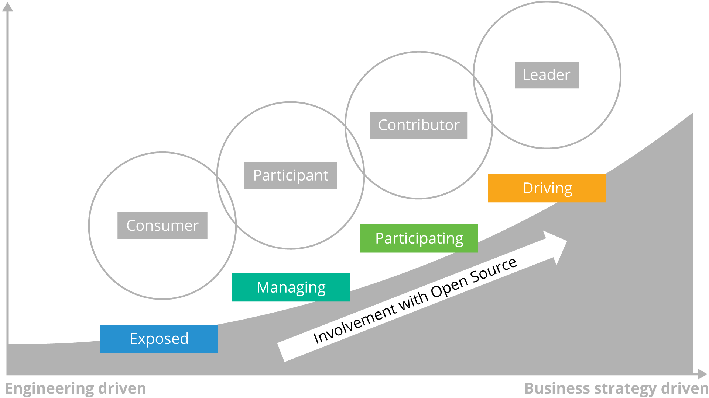

# Section: Introducing Open Source Business Models

## Lesson: Introduction

### Section Overview

In this section, we will provide definitions of several important open source business models, as well as comparisons between them. We will also discuss the relative strengths and weaknesses of each approach, and highlight which models can be used in which business scenarios.

### Learning Objectives

By the end of this section, you should be able to:

- Define the most often used open source business models.

- Explain the differences and similarities among these business models.

- Understand which models work best with which business scenarios.

## Lesson: Definitions

### What are the Major Open Source Business Models?

There are two ways to slice the notion of open source business models - those companies who consume open source (most organizations), vs. those who primarily produce open source. Let’s tackle the consumption side first.

**Consumption**

A recent Gartner study, highlighted above, showed that best in class software and technology organizations consume roughly 80% of the software they use in their products from open source, and then build the remaining 20% of their value add on top of that software stack to provide products to their customers. Doing this allows them to focus limited engineering resources on differentiated value while sharing the development costs of common code with the rest of the open source ecosystem.

Those companies producing open source code generally fall into the following types of business models (though they also likely strategically consume open source as well):

**Licensing**

This model relies on dual-licensing software under both a commercial license as well as an open source license, usually resulting in a ‘community edition’ and an ‘enterprise edition’ of the product that customers can choose depending upon what features they may need in the product. An example is the Oracle MySQL database, licensed under both a commercial license and the GNU Public License (later modules will cover licenses in more detail).

**Hosting**

In this model, companies provide the open source product in a Cloud-hosted SaaS (Software as a Service model). The primary examples of this are companies such as Amazon (Amazon Web Services) and Google (Google Cloud) that host open source technologies in hardened, scalable, enterprise-grade configurations.

**Support**

Enterprises often want to take advantage of the technological innovation provided by open source, but are more concerned with running their business on open source products. In this case, they turn to companies like RedHat and IBM, who offer support, technical guidance, professional services and training to help enterprises run business applications on top of an open source platform.

**Open Core**

This typically involves a capable core product which is free and open source. Around the core, a commercial entity provides closed source software that adds to or extends its capabilities. These add-ons are then sold as commercial software, and they can also be combined with the support model to provide training and technical support of the extensions.

### Comparing Open Source Business Models

In comparing these open source business models, it’s important to note that different businesses have different reasons for choosing a particular model, and as noted above, there are sometimes cases where models are combined (e.g. Open Core & Support). Here are some primary reasons why businesses choose each model:

**Consumption**

When your business has differentiated intellectual property but needs to reduce cost and complexity, strategically consuming open source software and building your product or service on top of that open source base platform gives you access to shared innovation that you can leverage to build compelling products without having to build everything yourself.

**Licensing**

Utilizing a dual-licensing strategy gives you the opportunity to get the value of consumption and shared input for a ‘community’ version of your product, while selling an ‘enterprise’ version of the product to realize revenue and continue to fund work on the ‘community’ version. It also gives you the ability to let customers ‘try before they buy’ and potentially grow their business to require access to your paid enterprise version.

**Hosting**

Providing a hosted solution of an open source project/product allows companies that have built infrastructure to support code for their own benefit to offer that same software as a service for their customers. Similar to the licensing model, this allows organizations to derive revenue for the software, which in terms helps fund their hosting infrastructure and also allows them to continue development of the open source project.

**Support**

If a technology company has in-house expertise and a reputation for contributing to one or more open source projects, providing a ‘hardened’ enterprise version of those projects that is bundled with technical support and training allows them to continue their work in that open source project and lets them provide their customers with a solid base platform that they can then run business software on reliably. Stock markets running on RedHat Enterprise Linux are a great example of this model.

**Open Core**

This business model can work very well, but it also can develop a poor reputation for an organization if the community feels that the closed source extensions provided on top of the open source code should rightfully be part of the open source core. This model requires a delicate balance of providing added value that large enterprises are willing to pay for while still allowing the free community version of a project to be useful to individuals, as well as small to medium businesses.

# Section: Developing an Open Source Strategy

## Lesson: Introduction

### Section Overview

In this section, we will show how to create an organizational open source strategy, discuss the value and need for doing so, and then discuss considerations for how the strategy will affect the implementation of open source policies.

### Learning Objectives

By the end of this section, you should be able to:

- Explain the need and value for creating an organizational open source strategy

- Describe the different types of strategies an organization might utilize

- Articulate a phased implementation plan to help turn the strategy into organizational policies

## Lesson: Overview of an Open Source Strategy

### What is an Open Source Strategy?

Strategy is a very broad term that we could discuss (or argue about) for hours, but we mean something very specific when we talk about Open Source:

- A concise, high level document

- Based on the organization’s business objectives

- Maps business objectives to open source software use and management directives

The strategy must be understandable to everyone that participates in open source related activities. It becomes the reference document for establishing agreement on future open source policies and processes. On an ongoing basis, it is an important tool for making new decisions, and for establishing program buy-in and commitment.

Many organizations also use an Open Source strategy as a vehicle to establish a mandate for implementing open source best practices and policies.

### Major Questions to Ask

In creating a practical open source strategy, three major questions must be answered. (The first two questions can be addressed in either order.)

**Where does the organization want to use Open Source?**

This question is critically important because the best practices for managing open source are quite different for various use cases. For instance, using open source tools internally poses little-to-no risk and does not require any license compliance regimen, but embedding open source in software that is distributed requires much more consideration and enabling elements.

**What business objectives are met by using Open Source?**

We’ve already talked about why companies use open source software. Getting clarity and buy-in as to which of these are important will greatly facilitate decision making on the next levels of detail.

**What will your organization do to ensure achieving Open Source business objectives?**

These are the decisions that create a mandate for an open source management program. Ideally they reflect industry best practices for getting the greatest advantage from open source while efficiently managing accompanying risks.

## Lesson: The Value of an Open Source Strategy

### Climbing the Open Source Ladder

Open Source can be a complex topic, when you factor in everything from licensing to community dynamics, talent acquisition and business dynamics. There are several stops on a typical organization’s journey in open source:

Let’s take each of these and break them down:

**Consumer**

The most common starting point for organizations is as an open source software user in their commercial products. Aggressively consuming open source components will increase your ability to differentiate and reduce overall time and cost to deliver commercial products. Here are the necessary components of the open source consumption strategy:

- A strategic classification scheme to guide decisions on what open source software to consume

- Ensure the company meets all obligations of its use of open source software

- Deploy automated workflow software for evaluating/approving open source usage

- Establish an Open Source Review Board (OSRB) to serve as a clearinghouse for all Open Source activities

- Create incremental investment in headcount and infrastructure in engineering, product management, and legal to manage a mix of closed source / open source software

**Participant**

Once your company is successfully using open source software in products or services, you can expand your strategy to participate in the open source community. Unless you have already hired experienced developers from the community, you will first need to engage more closely with the community to increase your visibility and to begin attracting the talent you need. Here are the necessary components of the open source participation strategy:

- Monitor community communication platforms like chat servers, mailing lists, forums, and websites to stay informed about project developments

- Attend relevant conferences and meetups to establish a relationship with the community

- Sponsor project events and foundations to improve visibility within the community

- Educate developers on how to participate in and contribute to open source projects

**Contributor**

As your company’s participation increases and you begin contributing code to an open source project, you need to selectively engage with targeted projects and communities to drive your company’s needs. Contributing to strategic open source projects can help your organization gain additional value as code contributions can help shape future features in the project that meet a company’s needs.

Here are the necessary components of the open source contribution strategy:

- Hire a staff director to lead open source strategy and manage the OSRB

- Hire contributors and committers to key open source communities that are critical to your products

- Deploy open source collaboration tools to support open source usage and contributions

- Add open source developer resources

- Incrementally invest in engineering, product management, and legal to engage with existing external communities

**Leader**

If a piece of open source technology becomes critical to your business or product, you’ll likely want a say in the strategic and technical direction of that project. Unlike traditional software however, you cannot necessarily ‘buy’ your way into or influence the leadership simply with money. In open source projects, those who do the work are the ones who get to help set the direction.

The final step in the open source strategy ladder is leadership. This scenario builds on all of the prior scenarios to capitalize on emerging trends in technology to establish a leadership position.

Leadership roles in existing open source communities are earned by establishing trust with the project members and by maintaining a high level of continuous contribution to the project.

This scenario requires significant investment in targeted open source communities and consortia to establish a leadership agenda. Here are the necessary components of the open source leadership strategy:

- Increase engagement with targeted open source communities

- Selectively engage with open standards to drive the company’s needs

- Engage with open source foundations

- Establish an open source project, organization, or foundation

- Significant investment primarily in engineering, product management, and legal to establish leadership in external communities and industry consortia

### Consider Your Current and Future Needs

As you can see, the natural evolution of an open source strategy is built on a series of steps that require an increased investment over time. It’s important to note that the decision for what role your organization should take is different for every open source project or codebase that you use.

In some cases, it may be acceptable to be a simple consumer of a small, solidly maintained open source project, but in other cases, if the open source project becomes a core element of your product or technology, you may need to consider being an active participant and/or contributor.

If the open source project is fundamental to your business and products, it’s a good idea to strive to be a leader for that effort, especially if it’s an open source project your organization helped to start.

Another important element to consider is that the level of involvement your organization may have in a project will change over time. Building a strategy is not a ‘one and done’ event. Be prepared to periodically review your open source strategy at regular intervals (6 months - 1 year is the typical time frame) to determine if you need to adjust your participation based on business or economic factors.

## Lesson: Implementation Considerations

### Phased Implementation

Open Source has an often quoted phrase ‘release early, release often.’ In the context of coding, this translates to many small changes that build upon each other over time, allowing for complete and easy code review of all changes, as well as more robust code because the changes provided are easier to test and debug.

The same model can and should be used when developing your open source strategy. By starting with a basic strategy that is tied to your short-to-medium term goals, you can begin to engage with open source projects and communities and then adjust your strategy (and the ensuing policies you’ll need to develop) as your organization becomes more comfortable and confident with the ways of open source.

In general, the phased approach usually follows the ladder graphic shown previously:

- Build a strategy (and policies) for consuming open source in an effective and efficient way

- Begin to participate in open source projects and communities by interacting/asking questions, reporting bugs, etc.

- Make small contributions at first (even if they are not code - documentation is a great way to get started)

- As you become more familiar and dependent upon an open source project, increase your contributions

- If you need a ‘seat at the table’ (or you helped start a project), make sustained and valuable contributions and investments in the open source project

### Implementation Considerations of Your Strategy

While we will cover the creation of open source organizational policies in the next section, this is a good opportunity to consider the ramifications of your strategy on policies you’ll be putting in place to implement your strategy.

The biggest considerations you’ll need to think about are time and money. How much time do you have to use when implementing your strategy? And how much resources (money and staff) are you prepared to put towards implementation of your chosen strategy?

**Time**

Like almost anything else in technology, working effectively with open source takes an investment of time - this is both in terms of human resources (staff) as well as effectively understanding and planning for the release cycles of the open source projects you’ll be using. Not every project has the same release cadence, and you’ll need to be cognizant of that as you put policies in place to determine which versions of code you consume, and when.

While we’ll cover security and keeping up-to-date with new open source releases in other modules, be aware that you’ll have to consider what time frames you’ll make decisions in regarding both consumption and staff participation in open source projects.

**Money**

In the Open Source Introduction module, we briefly covered that open source may be ‘free’ from a licensing cost, but by no means does that mean that it doesn’t have other costs associated with it.

Effectively participating in open source, whether simply consuming it effectively and strategically, or driving a particular standard costs money, primarily in the staffing area. You don’t need to start with a giant staff (more on that later), but you should be considering the needs you’ll have both in terms of software engineers and support staff (legal, business, project management) as you begin to put policies into place to help govern your organization’s open source efforts.

Considering time and money elements (and starting slowly with sensible plans to adjust over time) is the best method of making sure that the policies derived from your open source strategy succeed in the long run.

### Strategic Objective Examples

Here are some examples of objectives you may define as you go through the process of building your strategy - this is by no means an exhaustive list - your organization may have all of these, or potentially others not included in this list:

- Increase innovation through collaboration with technology leaders

- Speed deployment by using already developed and tested code

- Lower development costs by using free, already debugged code

- Lower deployment cost by using free alternatives to commercial tools and components

- Lower code maintenance costs by taking advantage of community maintenance

- Offer interoperability with other open source software

- Facilitate the creation of new capabilities by partners or customers

- Establish new markets or de facto standards

- Recruit and retain top technical talent

### Examples of Actions To Take

While we will go into more detail about how to define open source policies in the next section, here are some sample actions you could take in support of the objectives you define while building your strategy:

- An evaluation policy and acquisition process that

  - Chooses well among open source, available commercial and internal development options

  - Insures licensing terms compatible with your use and IP strategy

  - Considers support and lifecycle costs

- A code tracking policy and process that provides accurate knowledge of what software is used where

- An audit process that insures that you follow set policies

- A compliance process that insures that all OSS license requirements are consistently met

Action is where "the rubber hits the road" in an open source strategy. Targeting specific objectives creates the mandate for and shapes the open source management program.

The actions above are the most basic elements of a full open source management program; however, some organizations may not need all of these elements. For instance, an organization that never distributes open source in its products does not usually need to implement a license compliance process. Some organizations add other actions such as: software support and maintenance, steps to insure software security, objectives around open source contributions or leadership, or a specific mandate for executive involvement.

Some organizations will prioritize the actions in their strategy statement to indicate urgency or order of execution. Some organizations find it useful to assign owners to the individual actions.

As the development of your open source management program moves to the next phases, these action statements are driven into the policy and processes that implement this strategy.

# Section: Developing Open Source Policies

## Lesson: Introduction

### Section Overview

In this section, we will discuss how to develop open source policies that set the framework for executing your chosen open source strategy. Special emphasis will be given to key factors that affect the success and organizational adoption of these policies.

### Learning Objectives

By the end of this section, you should be able to:

- Describe the process for implementing open source policies that drive the execution of your chosen strategy

- Understand what key considerations you need to consider when defining your policies

- Explain how you can best design policies that encourage widespread adoption in your organization

- Articulate the role of industry best practices to open source policy development

## Lesson: Overview of Open Source Policy Areas

### What Should My Open Source Policy Focus On?

Organizations starting on their journey of open source sometimes get bogged down in the minutia of defining policies from the perspective of ‘FUD’ (Fear, Uncertainty, and Doubt). While there will be more detailed coverage of areas like open source compliance in future modules, we’d like to give a general overview of the areas that should be considered by all organizations in crafting their open source policies from the perspective of more effective utilization, not just avoidance of risk.

We’ll also try to address how you can consider both which policies you should focus on first, as well as how to socialize these policies across your organization for maximum effect.

To do this, we’ll first present the elements that should be in any organizations open source policies - note that this isn’t necessarily an exhaustive list, and there could be additional items depending on your specific business situation:

- **Discovery**

- **Review & Approval**

- **Commercial Procurement**

- **Code Management & Maintenance**

- **Community Interaction**

- **Compliance**

- **Executive Engagement**

### Discovery

Open Source Discovery and Evaluation covers how and where your team finds open source software of interest and by what criteria that software is vetted for inclusion in your organization’s software portfolio. Discovery should not be a hit or miss endeavor. Starting with the right direction and criteria (vs. ad hoc) streamlines this sometimes difficult process and avoids problems down the road.

Discovering useful open source seldom starts from a blank slate. Most organizations already use at least some open source software and this code can form the basis of an internal (approved) repository. When looking outside the existing portfolio, there is a temptation for engineers to get creative, but to reduce risk and increase efficiency, best practices dictate establishing a set of trusted sources, either through commercial supplier distributions (organizations like Red Hat, Google or others), or through software foundations like Cloud Native Computing Foundation.

Moreover, a range of community, government and commercial tools exist for finding and choosing appropriate open source project code and versions. For example, OpenHub provides excellent metadata on thousands of popular projects, and Github itself offers dashboard info on project releases. Key security info can be gleaned from the NIST vulnerability database and the open source vulnerability database project.

It’s important to engage all levels of the organization in developing these discovery policies - simply telling engineers that they cannot use open source except from specific internal repositories without further explanation, and without involving them in the decision process, will likely lead to ‘creative’ attempts to circumvent this policy, which makes compliance harder later on.

### Review & Approval

No matter how careful or diligent your discovery process, the real test faced by open source code must come from your review and approval processes. Review and approval are your first lines of defense against security, legal and operational risk that can accompany open source.

As with discovery, leveraging previously-vetted code can speed up this process, so if your open source team has not already done so, best practices dictate creating lists of approved components and versions, reviewed and approved license types, and previously-employed evaluation rationale and results.

Building clear criteria (and involving all stakeholders from engineers to program managers) avoids issues during discovery and speeds review. Additionally, it’s important to consider building shortcuts in this policy for low risk approvals that can speed up this process, reduce cost, and provide more incentive for engineering teams to adhere to these policies.

### Commercial Procurement

When you first think of discovering and integrating open source code, it’s natural to think primarily of code acquired freely over the Internet. But a substantial amount of open source code makes its way into organizations through commercial sourcing. Open source often accompanies and/or is an integral part of commercial applications and also frequently finds its way into deliverables from contracted development.

The risks and compliance obligations that accompany commercially-sourced open source are no different from those that come with directly acquired open source. The big difference is that rather than reaching out and downloading open source code directly, your organization receives that code implicitly, even silently, usually through long-standing conventional procurement processes.

For commercially-sourced open source, industry best practices dictate working with your organization’s supply chain and sourcing personnel to establish and enforce policies for:

- Reporting the presence of open source elements in 3rd party code

- IP verification, and where appropriate, indemnification

- Code scanning and review of supplier governance programs to supplement reporting (if any)

- Documentation and integration with downstream component tracking, release audit and other compliance activities

### Code Management & Maintenance

The concept of "code ownership" emanates from the practices of scores of companies working with open source over the last decade and a half. At the highest level, the practice gives open source code “a face” within your organization, a “go to” person who is close to the code and to the community that develops and maintains it. Also typically included under the code ownership role is coordinating support for that code, directly or through third parties.

The need for "ownership" arises from the “self-service” nature of open source. Management policy should dictate what type of stewardship these components require and the code owner’s roles and responsibilities.

Other tasks associated with code management and maintenance are

- Archiving externally sourced open source

- Creating a current master copy (including updates, patches, etc.) for internal use, as the basis for sharing and reuse

- Tracking ownership, approvals and other decisions with an audit trail

The accompanying support model must be flexible, scalable and sustainable, with low risk and overhead. Options include:

- Internal support (if resources are available, expertise is strong and risk is low)

- Commercial support aggregator

- Focused vendor support for business-critical components and/or platforms for technically complex components or those with high business/technical risk

### Community Interaction

Open source software is typically created and maintained by communities of like-minded developers. Participation in those communities confers a range of benefits on organizations that integrate and deploy their open source software, ranging from education to support to bug fixes and beyond.

Community interaction is not a binary decision. Participation is, instead, a continuum. You and your colleagues can choose to participate in a variety of roles across a range of activities, from a modest start as consumers of OSS up through ongoing involvement and even leadership. While the level of participation can evolve organically, it is always best if the level of community interaction is aligned with organization business goals and based upon a cost-benefit analysis.

Here are some levels of interaction to consider:

1. No Participation (not recommended)
2. Participate as individuals
   - No tie to company allowed
3. Participate in a community on your company’s behalf

   1. No IP conveyance

   2. Contribute requirements or bug fixes

   3. Convey company-developed binaries, libraries, etc.

4. Provide sponsorship or support to a community

5. Release company IP as OSS and establish a company-managed open source project

### Compliance

Compliance focuses on observance of open source policy and open source license terms. License compliance is the most visible part of Open Source Management for organizations that distribute software, and often provides the impetus for the establishment of open source program offices (more on this in the next lesson module).

However, compliance is not the "be all" or ”end all” of good governance – no one uses open source software primarily for the privilege of complying with its licenses. Compliance should be treated on a par with the other dimensions of open source management, and not as a “police action”.

For organizations that do not distribute software, compliance is focused on ensuring that the open source policy and processes are followed in order to assure the security, reliability and supportability of the software systems and applications.

Compliance policy needs to be explicit and detailed, with rules spelled out for complying both with organizational policy and with the terms of open source licenses. The need for compliance highlights the requirement to be able to identify and catalogue third-party code (including open source) in each release, together with accompanying terms (e.g., source code disclosure, attribution, etc.).

### Executive Engagement

Open Source Management is not solely the province of developers who actually touch the code. Nor is it uniquely under the purview of corporate lawyers concerned with protecting intellectual property (IP). Successful open source management is a collaborative effort, requiring participation from many roles and disciplines.

One often ignored set of participants is the organization’s executives. Executives may initially think of open source technology as merely a detail of technical implementation, and be content to participate in open source management through the chain of command. Enlightened executives will perceive the risk/benefit balance in open source and its potential for innovation and differentiation, resulting in greater executive participation in key decisions around open source management policy.

It’s important for executives to consider their role in the following policy areas:

- Involvement with overall open source policy creation and evolution

- Participation in open source review and approval

  - Typically through legal and lines of business

- Participation in high-level decisions about open source contributions, project sponsorship, etc.

- Receiving and reviewing regular reports on open source activity

## Lesson: Policy Implementation Considerations

### Human Factors in Policy Creation

Policy creation in relation to open source has some interesting human dynamics at play that are different from traditional HR or other policies that your organization might be used to creating. The collaborative and ‘community-led’ nature of open source focuses more on getting work done than it does on a set of rigid or formal processes.

Collaboration is the key element here. Rather than considering these policies strictly as punitive or ways to eliminate risk, they also need to be considered opportunities for different groups, including engineers, program managers, legal experts, and even executives to have transparent and frank discussions about how to get the most out of the organization’s engagement in open source.

It’s true that in some cases, management may have to make decisions about policies that aren’t always in agreement with other groups (usually engineering), but in giving everyone a voice in how policies are created, it will make it easier for everyone to comply and see how the policies make sense for the organization.

### Economic and Productivity Considerations

Another element to consider when crafting your open source policies is how their implementation will affect working productivity, and therefore, indirectly, the economic impact to your organization.

Building completely ‘bulletproof’ policies that cover every possible case, and require a massive human and technological infrastructure can seem like the ‘safest’ approach, but those can have unintended consequences, including making software development slow, unwieldy and so unpleasant that you run the risk of losing critical software talent to organizations without such rigid policies.

Additionally, building out the necessary process infrastructure for such heavyweight policies has economic cost both in tools and in detailed human oversight. The best approach to combat the temptation to build the ‘perfect policies’ is to consider the oft-repeated open source mantra of ‘release early, release often.’ Consider what minimum set of policies you need to implement your open source strategy, and then build on those as both your management team and development organization progress up the ladder of open source engagement.

# Section: Introducing the Open Source Program Office

## Lesson: Introduction

### Section Overview

In this section, we will discuss the role that the Open Source Program Office (OSPO) plays in helping define strategy, implementing associated policies, and guiding an organization's involvement in open source. There will be a more detailed coverage of how to set up and run an OSPO in a later module in this series.

### Learning Objectives

By the end of this section, you should be able to:

- Define the characteristics of an Open Source Program office

- Explain the role of an Open Source Program Office in guiding an organization's open source efforts

- Articulate some ways an Open Source Program Office can help define metrics for open source success

## Lesson: Overview of Open Source Program Office (OSPO)

### What is an OSPO and Why Does My Organization Need One?

A central open source program office is a designated place where open source is supported, nurtured, shared, explained, and grown inside a company. With such an office in place, businesses can establish and execute on their open source strategies in clear terms, giving their leaders, developers, marketers, and other staff the tools they need to make open source a success within their operations.

One of the biggest differences between traditional software development and open source development is the highly collaborative nature used in open source. For many businesses, the needed change in philosophy when approaching open source use doesn’t come easily or naturally.

That’s where the creation of an open source program can be a major boon. By creating an open source program office, businesses can enable, streamline and organize the use of open source in ways that tie it directly to a company’s long-term business plans. An open source program office is designed to be the center of the universe for a company’s open source operations and structure, helping to bring all the needed components together.

This can include setting code use, distribution, selection, auditing and other policies, as well as training developers, ensuring legal compliance and promoting and building community engagement. The office can also provide advocacy and communications about all things open source inside and outside the company.

### The Role of an OSPO

Ultimately, a well-organized open source program office is valuable because it can advance open source use, contribution, and creation inside companies for strategic advantage.

A successful office can greatly benefit corporate open source use by establishing processes that enable developers and their teams. It encourages standard coding and organizational practices, processes, and toolsets. At the same time, a program office can help avoid or remove unneeded, rigid processes which creative developers may circumvent or ignore anyway, threatening security and other aspects of projects.

The responsibilities of a program office are varied. These include:

- Clearly communicating the open source strategy within and outside the company

- Owning and overseeing the execution of the strategy

- Facilitating the effective use of open source in commercial products and services

- Ensuring high-quality and frequent releases of code to open source communities

- Engaging with developer communities and seeing that the company contributes back to other projects effectively

- Fostering an open source culture within an organization

- Maintaining open source license compliance reviews and oversight

For every company, the role of the open source program office will likely be custom-configured based on its business, products, and goals. There is no broad template for building an open source program that applies across all industries — or even across all companies in a single industry. That can make its creation a challenge, but you can learn lessons from other companies and bring them together to fit your own organization’s requirements.

Another key role for the open source program office is to bring substance and facts to the conversation when business units begin to consider open source in their plans so there is a full understanding of why it is being considered, what the consequences will be, and what is needed to reach its goals. It’s often a matter of framing the conversation so that stakeholders know where to start and what to think about as they weigh their decision.

### The OSPO’s Role in Defining Success Metrics

Open source program managers must demonstrate the return on investment (ROI) of their efforts. Let’s take a look at how an OSPO helps define some of the standard ways that organizations evaluate their open source programs, projects, and contributions.

Learning what to measure, how to define success, and how to best use this information to advance your open source program objectives, demonstrate effectiveness, and gain support is a critical function of any OSPO.

The goals you set, and metrics you track, will vary according to the reasons you’re investing in open source – whether it’s to recruit developers, bring in new ideas and technologies through open innovation, achieve faster time to market, lower development costs, or myriad other reasons.

It’s important to set goals according to your unique strategy – and seek buy-in from the executive team to ensure that the open source strategy aligns with the overall business strategy. An OSPO can provide that neutral place to help your organization think about these items strategically.

Experienced OSPO staff generally consider the following when building metrics:

- Their developers’ participation and level of influence in external open source projects

- Their organization’s reputation in open source communities

- Their ability to recruit and retain talented developers

- The general health of the organization’s own open source projects and the business-critical projects its developers contribute to

- How well they manage open source license compliance

### Final Thoughts on OSPO Creation

There are many other aspects to building and running an effective OSPO. So many, in fact, that we will have a dedicated section and lessons on this in later course modules in this series. For now, the most important thing to consider is that as you continue your journey up the leadership/participation ladder of open source engagement, you’ll eventually need some form of an OSPO.

As with strategy and policy definition, it’s important to remember the ‘release early, release often’ adage quoted earlier. You don’t need to staff an OSPO with hundreds of people right away to be effective. Starting with an open source leader with enough experience to help guide your organization, and a small staff that can assist them, is usually a good enough start for most organizations.

What you will find naturally is that well-functioning OSPO’s engage many different stakeholders (engineering, product management, and even executives) in ways that multiply their effectiveness despite their small size. We’ll talk more about finding and building open source leadership for an OSPO in future modules.
