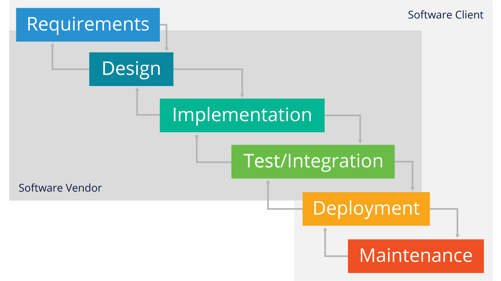
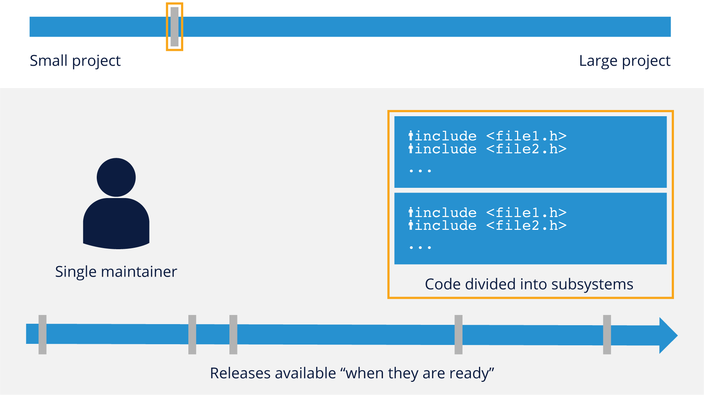
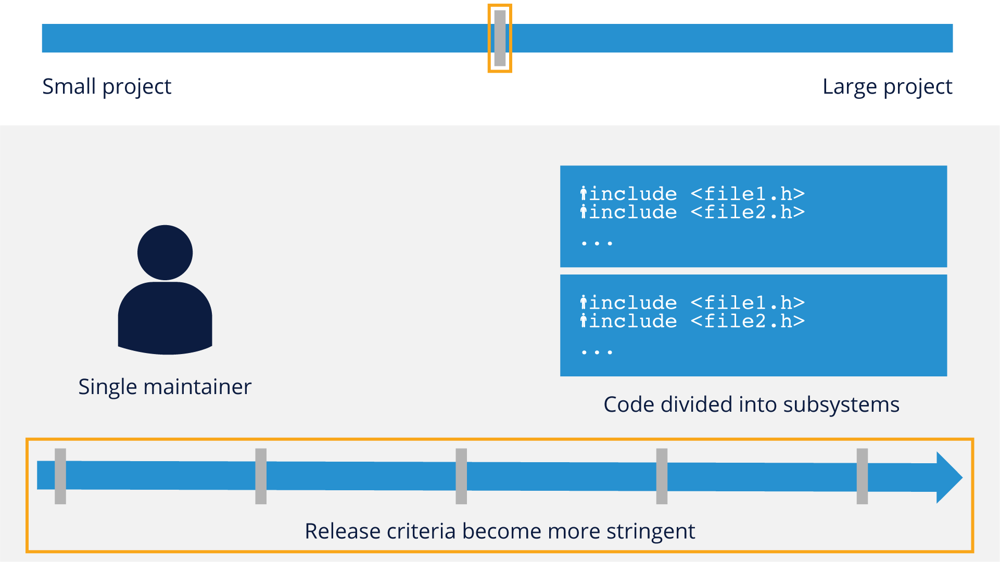
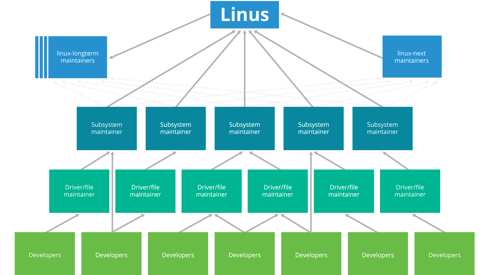
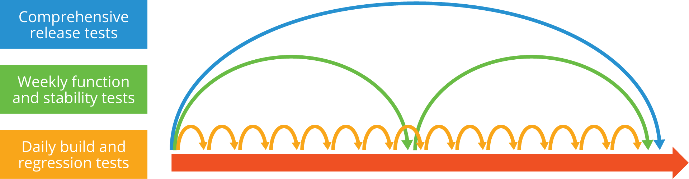
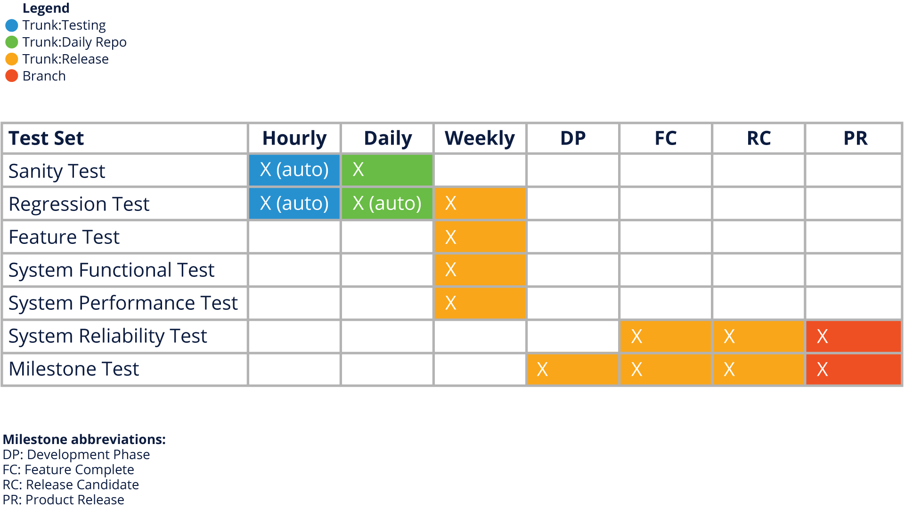

# Effective Open Source Development & Participation

## Lesson: Introduction

### Section Overview

### In this section, we will explore the core concepts and practices used in open source development and community participation and compare them with traditional closed-source development.

### Learning Objectives

By the end of this section, you should be able to:

* Explain core open source practices and the role they play in effective open source development and community engagement 
* Articulate the differences (and similarities) of these concepts when compared to closed-source software development

## Lesson: Requirements & Design

### Requirements in Open Source Software Development

Requirements are a key consideration for any form of software development, and open source is no different - however, the form and function of requirements gathering is significantly different than the ‘Waterfall’ requirements processes used in many traditional software development environments.

Consider this general overview of a typical open source development model:

As you can see from this graphic, ‘requirements’ generally come in the form of ‘feature requests’ from users or developers, and due to the more iterative/Agile nature of development (more on that shortly), there isn’t a long, protracted requirements phase for open source software development.

This has unique advantages in that it harnesses the ability to respond rapidly to changing requirements or the technology & business landscape in which the project is operating. However, it does require significant developer discipline, as well as core open source maintainers who are also helping to manage the long-term strategic goals of the project.

It should be noted that many of these principles are part of the [Agile Software Development Methodology](https://en.wikipedia.org/wiki/Agile_software_development), and indeed there are many similarities. We’ll discuss some slight differences in later sections.  

### Requirements in Traditional Closed Software Development

While more and more software development has adopted Agile and/or [DevOps](https://en.wikipedia.org/wiki/DevOps) approaches to software design, there are still significant pockets of traditional closed-source or proprietary software development models that take a more ‘Waterfall’ approach, as illustrated here:

While this approach does have some advantages in thoroughness of documentation (for example), it’s generally considered too heavyweight and significantly slower than the more iterative or Agile approach that open source software projects take. Additionally, it’s generally more difficult to implement with the typical geographically-dispersed development teams that exist in most open source software projects.

### Open Source Project Characteristics

We will be covering working with upstream open source projects in more detail in a future module, but there are several common characteristics of most open source projects that are important to understand before you can build effective development practices to engage with these communities.

While this is not an exhaustive list, here are some core characteristics of almost all open source projects:

*   Geographically-distributed development teams
*   Transparent communication and development practices
*   Distributed and transparent/open decision-making
*   Meritocratic cultures (those doing the work help drive project direction)
*   Resilience to organizational change
*   Self-organization
*   Scalable project development/management models
*   Peer review of all code contributions

### Scalable Development Models

A hallmark of successful open source development efforts is the ability to scale projects effectively depending upon the amount of participation available.  Below are examples of the structures that make that a reality:

Small projects usually have a single maintainer and a small body of code.  Releases are usually not strictly scheduled and are put out ‘when they are ready’.

As projects start to get slightly bigger, they still have irregular release cycles, but may start to divide the codebase into subsystems.  At this stage they still usually only have a single maintainer.

As projects trend toward medium-sized, they still usually have a single maintainer, but their release criteria will start to become more stringent, with regularly-scheduled releases.

Once projects pass the medium-sized mark, they start to look toward delegated maintainership, where the primary maintainer can no longer look after every single subsystem in the project.  Trusted developers/contributors who may have speciality or passion for a particular subsystem are appointed to look after that specific body of code.

Once projects graduate to the ‘large’ category, there are several changes - a further division of subsystems (sometimes into even more discrete parts) as well as a more detailed level of delegated maintainership and releases that are not only regular, but overseen by a dedicated set of maintainers, such as the Linux kernel’s LTE (Long-term Evolution) kernel branch.

A key element to these structures and development models is that they function by delegating responsibility for different project subsystems to ‘maintainers’ who have ultimate responsibility for the code in their subsystem.  This allows a level of specialization and oversight that frees up the overall project maintainer(s) to focus on the larger strategic and architectural picture of the project.

### Scalable Project Example - Linux

As an example of how successful projects implement this scalable development model in practice, consider one of the world’s most successful open source projects, the Linux Kernel:

While Linus Torvalds still maintains overall influence over the project, he relies heavily on a distributed set of maintainers for the different subsystems that are part of the kernel.  Not every open source project grows to this size or needs this level of control, but it’s informative to consider how effective control can be implemented over a large and diverse contributor base.

### Design Considerations in Open Source

Now that we’ve looked at some open source project characteristics and organizational models, let’s consider some core tenets of successful design practices within open source projects.

It’s important to consider how design manifests itself within open source projects and how that differs slightly from more traditional software development.  The main considerations fall into three main areas:

*   **Design in the Open**
*   **Recruit Others**
*   **Design for Acceptance**

Let’s take a look at these in a bit more detail in the following pages.

### Design in the Open

Openness and transparency are hallmarks of open source development, and design is no different.  Here are some best practices for ‘designing in the open’:

*   Communicate early and often on the project’s preferred communication platform
*   Provide code examples and possibly reference implementations
*   Anticipate feedback
    *   Acknowledge good feedback and re-work your contribution
*   Respond promptly to questions, particularly from potential contributors
    *   Signal willingness to adapt your design if someone else will do the work
*   Plan for modularity, even if the first designs are not modular

Flexibility is also a key element here - understanding that your code is being evaluated and viewed by more eyes than in a traditional closed-source project is important to help you make the best design decisions and get your code contribution accepted into the project.

Taking a modular approach (or at least planning for how you can make your code modular) is also something that can be different from a traditional development model, where monolithic designs tend to be more prevalent.  Thinking about modularity from the start not only helps the overall open source project, it’s a good engineering practice in and of itself.

### Recruit Others

Collaboration is the name of the game in open source projects, and in a much deeper way than you may normally be used to in a typical corporate or closed-source development effort.  

Here are some things to think about as you recruit others to assist you in open source:

*   Scratch your own itch, nobody else will scratch it for you… unless they have the same itch
*   To decrease your development burden, write code that will attract others
    *   Make sure your contribution is scoped broadly enough to attract other developers
    *   Be responsive and proactive if someone indicates interest in your code
*   Don’t be surprised if it’s a competitor
    *   Often the companies with the most to gain from a feature in an open source project are in the same line of business
    *   There is a rich history of open source collaboration between competitors

Designing your code with others in mind does take more time and effort than more narrowly-scoped development practices, but it is worth it in the end when you witness the multiplicative effect of an effective open source project’s contributor base.

### Design for Acceptance

Based on everything said so far, it should be clear at this point that your goal in participation within open source should be to think of how you get effective acceptance of your designs and ideas.

Some things to consider to help with this are:

*   Design your contribution to be written and integrated in the smallest parts possible
    *   Smaller patches are easier for maintainers to integrate
    *   Open source projects favor a modular approach, because it promotes extensibility
*   Properly scope the design, and subdivide your plans if necessary
    *   Larger changes are more likely to be adopted as a series of smaller changes with concrete milestones
    *   Communicate your overall plan to provide context, but don’t expect universal buy-in right away
*   Be as non-intrusive as possible to other project subsystems
    *   If you believe you need to change a core system component, communicate far in advance and solicit input from their maintainers before getting started

If you put yourself in the shoes of another developer or maintainer who has to integrate or later maintain your code, it will help give you the proper perspective for designing for acceptance. 

## Lesson: Decisions & Development Cadence

### Decision Process & Communication Expectations

In addition to thinking about designing in a new way, it’s important to understand how decisions are made (and communicated) in an open source project.  Often, the tenets listed below are a bit of a departure from traditional software development methodologies:

*   Decisions are decentralized by appointing trusted delegates, usually called “subsystem maintainers”
*   Trust is built by past record of good participation and wise decisions on smaller issues
*   Decentralized nature requires an extra focus on transparency
    *   Discussions always happen in the open
    *   Examples: Mailing lists, IRC, Slack, etc.
*   Often the discussion itself is the documented record of the outcome (archives are therefore critical)

In short, communication in electronic forms is not only critical to open source projects, there is usually more discussion frequency and depth than in a traditional software project where you may only be communicating with your immediate development peers.

Understanding and preparing yourself to communicate in this somewhat different way is important, and we’ll cover more about how to approach this in later sections of this training.

### Development Process & Cadence

Let’s bring the graphic presented earlier in this training back to get a better idea of how an open source development process works with regard to cadence:

Open source projects live by the mantra ‘**Release Early, Release Often**.’  While this may seem obvious based on the graphic above, it has elements that affect the development process and cadence, specifically:

*   Don’t expect code perfection the first time
    *   Submit code when it works well enough to address your goal
    *   Code stabilization is part of the community process
    *   Allow the developer community to help guide and shape the code
*   Implement functionality in the smallest reasonable chunks possible
    *   Small changes are easier to test & integrate
*   Be prepared to rework your code (potentially multiple times) to get it accepted

The cadence of code submissions/rework in open source projects is usually the biggest difference for developers used to a more traditional software development environment, and the higher pace used in open source projects will likely take a bit of getting used to.  However, once you are familiar with this way of working, you’ll probably find that it becomes more natural and almost second-nature to work in this fashion.

## Lesson: Working with Large Distributed Development Teams

### Communities

From earlier sections of this training, it’s hopefully obvious that the dynamics of working with open source projects and their communities is a bit different than what you may be used to with strictly corporate or internal development efforts.

The concept of community isn’t difficult to understand - most of us live in communities and are experienced with different levels of community in our daily lives.  When applied to open source projects however, there are some things to consider:

1. **No two communities are exactly the same**
2. **Communities don’t work for individual companies**

There are well known open source project communities, such as the Linux kernel, or Kubernetes that have some similarities, but different ‘personalities’, which are usually the result of how they were started, the governance models put into place, and just the experiences of their founding members.

While it’s true that a lot of organizations now invest in open source (Kubernetes, for example, was started by Google), open source project communities don’t work for individual companies, so getting things done for your organization becomes about making sustained contributions and doing good work (more on that in a bit).

Understanding that open source projects aren’t your organization’s ‘free developers’ is very important, as making that assumption can lead to problematic challenges later on. In the next few pages we’ll give you some best practices for engaging with the open source community and show you how some basic communications tool etiquette will go a long way toward helping you work effectively with these large distributed development teams.

### Preparing to Engage

Before you jump into directly working with a community, it’s often beneficial to take a bit of time to research and prepare the best approach to get you off on the right foot.  Part of this research is looking at what you (or your organization) is prepared to do in support of the community.

**Determine What You Have to Offer**

Open source projects are about more than simply code - there are many areas you can contribute in:

*   Software Development
*   Testing/Quality Assurance
*   Documentation
*   User Experience/GUI Design
*   Evangelism/Communications

If you have expertise in multiple of these areas, you can certainly contribute in multiple roles.

**Determine Your Time Commitment**

It helps if both you and/or your organization is realistic about what kind of time commitment you can bring to the table.  Try to commit to what you can realistically deliver, as most communities respect completed work more than hollow offers of help.

Also remember that your commitment reflects not only on you, but also on the organization you represent.

### Getting to Know the Community

As you are formulating your plan to engage with the community, it’s important to get to know some critical things about who they are and how they work.

#### Understand How the Community Communicates

Obviously, a huge part of understanding the dynamics of a community are understanding where and how they communicate.  Some communities still prefer email - others have migrated to asynchronous forums like IRC (Internet Relay Chat), Slack, Github issues, Discord, or other forum tools.  

Take some time to figure out not just what platform is being used, but lurk around a bit to see what kinds of questions get asked, how they get answered, and what other sources of information (bug trackers, wikis, etc.) get referenced in answers from the community.

By doing this research, and making an effort to try to find answers before you ask in the community, you are showing existing community members that you are serious about being a good community member, and that goes a long way.

#### Understand How the Community is Governed

Lurking on communications forums and doing your homework also helps you understand the governance models in place for a project.  Some projects are hierarchies with clear chains of command/report.  Some projects have a flatter organizational model.

Understanding the dynamics of governance not only helps you be better prepared to contribute, it also helps you know which groups in the community are best suited to answer any questions you may have.

#### Get to Know the People

Though open source projects utilize geographically-distributed teams as a default, it’s important to try to get to know community members personally, as you’ll often be in a position to require help (or give help to others) in getting a contribution or idea accepted.  If possible, try to participate in in-person or virtual meetups that many projects organize to help new projects members get to know established project veterans.

### Let’s Engage!

Ok, you’ve done your research and now you’re ready to engage with an open source community!  There are four main areas you should be thinking about in your engagement.

#### Communicate What You’re Working On

Don’t work on something for the community ‘in private’ until you have it just perfect.  Remember the earlier advice of ‘Release Early, Release Often.’  It’s usually a good idea to not only check the communications channels to see if what you are planning has already been done, but it’s also good to signal your intent to build a new feature or fix a bug, so that the community (and maintainers) can help you plan for the best way to get your contribution accepted.  The community wants to see you succeed, so letting them help you as you prepare your contribution is a good idea.

#### Acknowledge People and Resources You Use

Very few contributions to open source are devoid of other code that you’re building upon.  Remember to acknowledge any other work/libraries/developments you used in your contribution, and help the community find these resources too, as they can often be helpful to the entire project.

#### Give Back to the Community

Besides the obvious contribution of code, consider other ways you can give back to the community as well, such as arranging hardware gifts from your organization (if possible), or arranging meetups for the teams, or simply spending time answering questions for the new members that come after you.

Code is definitely important, but truly successful open source projects thrive on the ‘non-code’ contributions as well.

#### Plan an Exit Strategy

Communities are cyclical - eventually, you and/or your organization may need to exit the community.  Try to leave the community in better shape than you entered it.  Some simple things you can do to make this happen are:

*   Identify a successor or someone to take over your code
*   Introduce that successor to the rest of the community
*   Inform the community as soon as possible so that they have time to plan for any changes they may need to make as a result of your exit.

Remember that even in exiting a community, your behavior reflects on you and/or your organization.

### Communication Etiquette

The two main types of communication tools in use within most projects are some sort of messaging system (email, Slack, IRC, etc.) and some sort of issue or bug tracking software (JIRA, Github Issues, etc.).  Here are some general tips for effective use of each type of platform:

#### Messaging

*   Most messages/communications are in English
*   Feedback is likely to come in short/focused bursts
*   Try not to take criticisms of code personally, but accept good suggestions and rework your code
*   If you are reviewing code, critique the code/idea, but don’t criticize the person
*   Be aware of timezones, and don’t necessarily expect an immediate response
*   Try to ‘show your work’ if asking a question so that the community can point you in the right direction

#### Bug/Issue Tracking

*   Keep bug reports concise but thorough
*   Check the bug/issue system to see if what you’re reporting is already there
*   Give enough relevant information, including any test code which triggers the bug
*   Understand that there is no community obligation to fix a bug - be prepared for the fact that you might need to fix it yourself
*   Give any relevant updates to information if you fix the bug or find a workaround

### Top Four Things to Remember

There are a lot of things to consider when you first start working with an open source community.  However, if you keep the following four things in mind, they should cover most situations:

#### Understand Community Governance

Each community is different, but all of your ‘patches’ need to fit within the overall whole.

#### Understand Community Motivations

Successful communities are powered by motivated people - and they are not always motivated strictly by money - peer recognition and status are often powerful forces in open source.

#### Communities Need Nurturing

Community participation is a cycle - expect change and be prepared to help bring in new members periodically.

#### Be Humble But Bold

Leadership in open source is earned, not granted, and the organization you work for and their reputation won’t necessarily grant you influence in a particular project.

It’s critical to remember that there is a big difference between Leadership and Control.  Most open source communities will balk at attempts to overly control the project direction, but expect that participants will make valuable contributions before earning the right to lead.

Striking the right balance between being bold and participating actively while being humble enough to take feedback and rework your code contributions takes time and practice, but keeping this balance in mind helps guide you in the right direction.

# The Role of Continuous Integration & Testing

## Lesson: Introduction

### Section Overview

### In this section, we will discuss the role of continuous integration, testing, and deployment in open source, including tools, best practices, and costs associated with this critical concept.

### Learning Objectives

By the end of this section, you should be able to:

*   Describe continuous integration, testing, and deployment
*   Describe some of the different tools used to implement these practices
*   Articulate the costs and benefits of implementing these concepts

### Lesson: The Role of Continuous Integration, Testing, and Deployment in Open Source

### Why Continuous Integration?

Once upon a time, most software was written by a relatively small group of developers, often working in the same location and in frequent contact. Coordination and division of responsibilities could be done in a straightforward manner. 

Revision control systems **were developed long ago to accommodate more than one contributor working on a project. Usually there is a repository** which stores the master copy of a project, with one or more developers possessing the ability to make changes and then check them in. 

Things get more complicated when there are many developers working in many different locations on a project with many subsystems. The Linux kernel was the first really huge distributed development project, and its creator, Linus Torvalds, invented the **git** system for rationalizing distributed development. 

However, a revision control system does not solve the problem of making sure what a diverse group of contributors is doing actually works together; that one set of new code or bug fixes does not conflict with another. That can only be done by testing. 

Even the testing requires multiple steps such as:

*   Can overlapping sets of changes be applied simultaneously, or do they conflict (a good revision control system such as **git** can handle most of this work, but it still often requires human intervention). 
*   When all changes are applied does the project even compile? For example, one patch set might remove a header file that another one needs. This does not get picked up by the revision control system. 
*   Does it work on all possible targets? That might mean differing hardware (say **x86 vs ARM**) or different operating  systems (say **Linux vs MacOS or Windows**) or different library, language or utility versions. 
*   What does **working** mean? Are there non-trivial test suites that can exercise a representative workload enough to give confidence things are fine?

**Continuous Integration** techniques ensure that testing is so frequent that any problems can not persist for long, which helps distributed developers stay on the same page. 

Projects absorb changes rapidly and in real time (multiple times per day usually) run automated tests to make sure things are in harmony. In general, the process looks like this:

### Continuous Delivery and Continuous Deployment

The whole process of continuous delivery and continuous deployment can be delineated as three separate steps, or stages: 

1. **Continuous Integration**

Changes are to be merged into the main branch (“master”) as often as possible. **Automated builds** are run on as many variations of software and hardware as possible. Conflicts are resolved as soon as they arise. 

2. **Continuous Testing/Delivery**

The release process is automated and projects are ready to be delivered to consumers of the build. Thorough testing is done on all relevant platforms. 

3. **Continuous Deployment**

The product is released to customers, once again in an automated fashion. 

The time gap between these steps is meant to be as close to zero as possible. In a perfect world, developer changes can reach end user customers the same day or even in minutes. These terms can be defined somewhat differently; for example, continuous integration can be considered to include both delivery and deployment. 

### Continuous Testing

A key component of the continuous delivery and deployment cycle is automated and continuous tests that are run frequently on the open source code base.  The concept of overlapping test cycles is used to make sure that code being integrated through continuous integration (remember, in small change sets) is thoroughly tested and it’s easy to spot potential issues.  An example might look like this:

The overlapping release cycles of an open source project give it the ability to release often while keeping a tighter control on overall software quality:

### Costs and Benefits

Obviously, nothing comes for free in software development, so it’s important to consider the costs and benefits involved with continuous delivery and deployment.  Below are some of the examples of both cost and benefits:

#### Costs

*   Changes have to be merged very often, probably at least once a day, putting a possible strain on developers. 
*   The repository must be monitored by **a continuous integration server**, which runs scripted automation tests every time contributions are made. Staff has to be allocated to do this. 
*   Scripts and other tools have to be run to perform automated tests and report their results and take appropriate actions. It can be a lot of work to prepare this infrastructure. 

#### Benefits

*   Developers do not go down the wrong path and compound fixable mistakes, or get in each other’s way, which in the end saves valuable time. 
*   The build steps are fully automated, all the work has been done up front instead of each time build testing needs to be done. 
*   Regressions (bugs which break working products) may be minimized, which means that released software should have fewer bugs. 

Setting up a continuous integration pipeline is not trivial and can take quite a bit of experience and effort to get right. But “an ounce of prevention is worth a pound of cure.” There are many existing tools and services that can help make the work less daunting. 

### Tools

There are many well developed continuous integration software tools. For a summary of such products, see [https://www.softwaretestinghelp.com/tools/24-best-continuous-integration-tool/](https://www.softwaretestinghelp.com/tools/24-best-continuous-integration-tool/).  Note that some of these are free tools and some are not.

Here are some of the most often utilized tools:

*   Jenkins - [https://jenkins-ci.org](https://jenkins-ci.org)
*   Circle CI - [https://circleci.com/](https://circleci.com/docs/skip-a-build)
*   Travis - [https://travis-ci.org/](https://travis-ci.org/)
*   Github Integrity - [http://integrity.github.io/](http://integrity.github.io/)

One thing to keep in mind is that there are always new tools being developed, so it’s a good idea to check Google and/or discuss with other developers what tools for continuous integration they are using.

### The Continuous Delivery Foundation

Another way of keeping up with the latest in continuous delivery is to take a look at the **Continuous Delivery Foundation (CDF)**, a project announced by the **Linux Foundation** in March 2019. It is designed to be a vendor-neutral home for the coalescence of significant projects in the CI/CD (continuous delivery and integration) universe. 

By establishing and documenting best practices, working out guidelines and making training available, the goal is to evangelize and spread CI/CD and DevOps practices and improve product release processes. 

**The founding projects** are: 

*   **Jenkins**: an OSS CI/CD system 
*   **Jenkins X**: Jenkins for Kubernetes
*   **Spinnaker**: an OSS multicloud CD platform 
*   **Tekton**: an OSS specification for CI/CD components 

This Foundation’s **TOC** (Technical Oversight Committee) has an open governance model that welcomes contributions. 

Founding members of this initiative  include: 

**Alauda, Alibaba, Anchore, Armory.io, Atos, Autodesk, Capital One, CircleCI, CloudBees, DeployHub, GitLab, Google, HSBC, Huawei, IBM, JFrog, Netflix, Puppet, Rancher, Red Hat, SAP, Snyk, and SumoLogic**. 

See how you can get involved, or just follow the foundation's progress at https://cd.foundation. 

# Applying Open Source Methodologies Internally

## Lesson: Introduction

### Section Overview

In this section, we will provide information on how to apply open source principles to internal or normally ‘closed’ development efforts, a process called ‘Inner Source.’  We’ll cover the practical reasons for implementing this practice, as well as how it can benefit your organization by supporting better open source engagement with external audiences.

### Learning Objectives

By the end of this section, you should be able to:

* Describe what Inner Source is and how it's useful for improving internal projects as well as external open source engagement.
* Explain some practical steps that can be taken to implement Inner Source practices in your organization.

## Lesson: Why Inner Source?

### What is Inner Source?

According to [Wikipedia](https://en.wikipedia.org/wiki/Inner_source), Inner Source is defined as: “The use of [open source](https://en.wikipedia.org/wiki/Open-source_software) [software development](https://en.wikipedia.org/wiki/Software_development) best practices and the establishment of an [open source-like culture](https://en.wikipedia.org/wiki/Open-source_model) within organizations. The organization may still develop closed source[ software](https://en.wikipedia.org/wiki/Proprietary_software), but internally opens up its development. The term was coined by [Tim O'Reilly](https://en.wikipedia.org/wiki/Tim_O%27Reilly) in 2000.”

It’s important to note the open source-like culture piece of this definition.  Simply adopting open source development practices (as we’ve described in this training) will still benefit your development process internally, but to achieve the full benefit of Inner Source, it’s important to build a more open and transparent culture internally within your development organization (and support orgs like Legal, Finance, HR and management).

### Why Inner Source?

There are many reasons why Inner Source principles makes sense for internal development, and we’ll list some of the most important below:

**More efficient and effective development**

* Faster Time-to-Market
* Reduced development costs through software reuse

**Better cross-organizational collaboration**

* Cost and risk sharing among organizational units
* Program-wide information exchange

**More successful software reuse**

* Use of competences missing at component providers
* Relief of component providers

**Enhanced knowledge sharing**

* Community-based learning
* Openness and availability of knowledge

**Better engagement with external open source**

* Developers don’t have to context-switch between internal and open source development practices
* Recruiting/onboarding of open source developers made easier

We’ll next cover some of the main differences between traditional and inner source development practices, and some of these should already look familiar based on what we’ve covered so far in this module.  We’ll also try to give some practical tips on how to implement these practices in your organization.

### Communication in Inner Source

As we’ve covered earlier in this module, transparent communications are critical to the success of open source projects, and they are equally as important to inner source.

They also tend to be the areas that have the greatest cultural challenge, as private emails, face-to-face meetings, and private conference calls are usually the norm in most internal development projects.  Opening up your internal communication practices with asynchronous tools like IRC, Slack, and transparent forums can help not only facilitate cross-project collaboration, but it can prepare your organization to work more effectively in external open source projects.

Whatever tool you choose (even if it’s an email alias), make sure that there are open archives available and that decisions about the project direction are discussed in the open so that project decisions are recorded in a place that everyone has access to.

### Open Involvement in Inner Source

Unlike traditional internal development, which is usually done by a core team in a closed repository, inner source projects by definition need to be built in the open.  This means not only open communication, as noted above, but also open software repositories, published roadmaps and documentation, as well as easy ‘onramps’ and a clear governance model for contribution.

Additionally, clear and transparent bug and issue tracking is a must.  Many teams find this open involvement of developers and users who aren’t part of the core team the most challenging aspect to inner source, as it opens up your project and code to outside scrutiny.  The positive side of this, however, is that it forces you to write better code, clearer documentation, and to think through your architecture from an outside perspective. 

### Peer Review in Inner Source

Since inner source practices mean you are involving users who aren’t part of your core project team, the concept of peer review becomes very important. While you may have set up a practice of code review or even pair programming, having ‘external’ developers looking at your code is quite different.

They are likely to bring fresh perspectives (and a lot of questions at first) to code reviews of the project.  However, they also bring fresh resources that your team may not have had to perform rigorous reviews prior to code being committed. Additionally, as previously external contributors become more familiar with your code base, and your team more familiar with them, it helps build a web of trust and cross-pollination of ideas.

### Iterative Releases in Inner Source

We’ve covered both the iterative nature and the ‘release early, release often’ mantra of open source in this module - this is usually in direct contrast to most internal development efforts which use a fixed release cycle with a defined roadmap that doesn’t change very quickly.

By utilizing a more iterative or Agile approach to development, and by integrating smaller changes to the code base, you can not only adapt more easily to changing requirements, you can prevent a lot of regression or costly bugs that once codified in a project’s architecture are difficult to fix. 

Utilizing the practices mentioned earlier in this training for continuous integration/testing/deployment will allow your inner source project to not only work more effectively, but it will also train the development teams to work with external open source projects who utilize this style of development.

### Staffing in Inner Source

The human resources aspects of Inner Source are sometimes very challenging in organizations where traditional hierarchies or cultures assign developers to specific projects and don’t allow for them to contribute to any other work inside of the company.

It’s important to consider how to incentivize developers to participate and contribute to projects inside of the organization that they may consume as part of their codebase.  It’s also important to make sure that management teams are fully supportive and themselves incentivized to allow this kind of cross-team collaboration.

There is, of course, a balancing act in play here, where developers will need to make sure they contribute effectively to their core project, while finding related projects that they can make valuable contributions to as well.  For this reason, it’s usually best to consider having project developers contribute to common infrastructure or platform coding - we’ll cover that a little bit more shortly.

One major benefit that can come from allowing this kind of cross-team collaboration is that developer knowledge, morale, and even retention can improve if engineers feel like they can make valuable contributions to the organization beyond their own team.

### Implementation Considerations

All of the suggestions for implementing inner source are possible, but also sometimes extremely challenging in organizations where traditional command and control hierarchies exist.  Therefore, it’s often a good idea to start implementing inner source ‘at the edge,’ with small projects that may already have quite a bit of interdependence.  

For example, foundational libraries, platforms or common user-interface components are generally good candidates for these kinds of efforts, but it will still require both cultural change (on both the component teams and teams that consume those components) as well as potential code re-architecting/documentation, cleanup, etc., to allow for successful inner source.

Try to secure early wins with small projects, and follow the ‘release early, release often’ mantra of evaluating your inner source program to see what needs to be changed as you go along.  Most importantly, understand that this process, while incredibly helpful, can take months (if not years) to bear successful fruit - keep at it!
