# Open Source Licensing and Compliance Basics

## Lesson: Introduction

### Section Overview

In this section, we'll explain the role of open source licenses, describe the most common types of licenses and give guidance on how to choose the right license for a particular situation. We'll also cover the basics of intellectual property and copyright in software, as these are key concepts to understanding licensing in general.

### Learning Objectives

By the end of this section, you should be able to:

- Describe intellectual property and copyright in software and how they relate to licensing
- Explain open source licenses, including the most common types of licenses in use today
- Articulate what criteria you should use when selecting a particular license for your organization and/or project

## Lesson: Intellectual Property and Copyright

### What is Intellectual Property?

Intellectual property is a core element that needs to be understood to be able to make intelligent choices around open source and other software license types. There are several categories of Intellectual Property, as listed below:

- **Copyright:** protects original works of authorship
  - Protects expression (not the underlying idea)
  - Covers software, books, and similar works
- **Patents**: useful inventions that are novel and non-obvious
  - Creates a limited monopoly to incentivize innovation
- **Trade secrets**: protects valuable confidential information
- **Trademarks**: protects marks (word, logos, slogans, color, etc.) that identify the source of the product
  - Consumer and brand protection; helps avoid consumer confusion and brand dilution

For our purposes in this course we'll focus on copyright and patents, the areas most relevant to Open Source license compliance.

### General Copyright Concepts in Software

Copyright is one of the two critical elements (patents is the other) that inform open source license compliance. Here are some basic elements of copyright:

- Copyright protects creative works such as books, movies, pictures, music, maps
- **Software is considered a creative work and is protected by copyright**
  - Not the functionality (that's protected by patents) but the expression (creativity in implementation details)
  - This protection includes software in binary or source code form
- The copyright owner only has control over the work that he or she created, not someone else's independent creation
- Infringement may occur if copying without the permission of the author

### Most Relevant Copyright Rights in Software

There are some important rights related to copyrights with software. How these rights are granted relates to licenses (which we will cover shortly). Specifically, the relevant rights, which vary by jurisdiction, are:

- The right to _reproduce_ the software – making copies
- The right to create "_derivative works_" – making modifications
  - The term derivative work comes from the US Copyright Act
  - In general it refers to a new work based upon an original work to which enough original creative work has been added so that the new work represents an original work of authorship rather than a copy
- The right to _distribute_
  - Distribution is generally viewed as the provision of a copy of a piece of software, in binary or source code form, to another entity (an individual or organization outside your company or organization)

_It's important to note here that the interpretation of what constitutes a "derivative work" or a “distribution” is subject to debate in the Open Source community and within Open Source legal circles, so this is an area that will continue to evolve over time._

### Patent Concepts in Software

Patents are also an important area that can have a significant bearing on open source compliance (depending on license type, which we will also cover a bit later).

Some critical elements of patents include:

- Patents protect functionality – this can include a method of operation, such as a computer program
  - They do not protect abstract ideas, or laws of nature
- A patent application must be made in a specific jurisdiction in order to obtain a patent in that country. If a patent is awarded, the owner has the right to stop anybody from exercising its functionality, regardless of independent creation
- Other parties who want to use the technology may seek a patent license (which may grant rights to use, make, have made, sell, offer for sale, and import the technology)

It's critical to note that patent infringement may occur even if other parties independently create the same invention or software.

### License Basics

While we will cover more detailed aspects of licenses shortly, it's important to have some basic understanding of what licenses do and what they provide.

- A "license" is the way a copyright or patent holder gives permission or rights to someone else
- The license can be limited to:
  - Types of use allowed (commercial / non-commercial, distribution, derivative works / to make, have made, manufacture)
  - Exclusive or non-exclusive terms
  - Geographical scope
  - Perpetual or time limited duration
- The license can have conditions on the grants, meaning you only get the license if you comply with certain obligations
  - E.g, provide attribution, or give a reciprocal license
- May also include contractual terms regarding warranties, indemnification, support, upgrade, maintenance

## Lesson: Open Source License Types

### Overall License Categories

Armed with the information from the preceding pages, you should have a basic understanding of what licenses are used for. Let's take a look at the overall license landscape (including closed source licenses) below:

This diagram gives a general overview of both Open Source and Closed Source licenses. While we will dive into more detail on the open source licenses types shortly, it's good to get a perspective of the different types of licenses generally available.

On the open source side, licenses generally fall into two main categories:

**Permissive**

These licenses only impose minimal requirements on what you must do when redistributing the software. Those requirements are typically limited to things like retaining or delivering attribution notices.

**Copyleft/Reciprocal**

Copyleft licenses are sometimes called protective or reciprocal licenses. They have requirements for how the software can be redistributed, as well as requirements that may impact how derivative works can be distributed, such as requiring release of all changes/enhancements you may make to the software.

An important resource to bookmark is the Open Source Initiative ([https://opensource.org/](https://opensource.org/)), the organization responsible for tracking and vetting approved open source licenses. There is a lot more detail in their website about the definition and types of open source licenses.

### Permissive Open Source Licenses

As mentioned earlier, permissive licenses generally have the least amount of restrictions on what you must do if you make changes and redistribute the software. For that reason, they are generally (but not always) on pre-approved lists within companies that specify what open source software license types can be consumed by engineers in the organization.

Let's take the example of the BSD-3-Clause license. This license is an example of a permissive license that allows unlimited redistribution of changes for any purpose in source or object code form as long as its copyright notices and the license's disclaimers of warranty are maintained.

However, the license contains a clause restricting use of the names of contributors for endorsement of a derived work without specific permission.

Other examples of permissive licenses include: MIT, Apache-2.0.

### Copyleft/Reciprocal Licenses

Some licenses require that if derivative works (or software in the same file, same program or other boundary) are distributed, the distribution is under the same terms as the original work.

This is referred to as a "copyleft" or “reciprocal” effect and can have important consequences if your derivative work is, for example, a highly proprietary piece of software used to provide a unique advantage for your company. In some cases, this could require you to release the source code of a proprietary work that is combined with open source software to anyone to whom you distribute the compiled or binary version of the work.

Here is an example of license reciprocity from the GPL version 2.0:

> You must cause any work that you distribute or publish, that in whole or in part contains or is derived from the Program or any part thereof, to be licensed […] under the terms of this License.

Other licenses that include reciprocity or Copyleft clauses include all versions of the GPL, LGPL, AGPL, MPL and CDDL. You can see more details for these at [https://opensource.org/licenses](https://opensource.org/licenses).

### License Compatibility

License compatibility is the process of ensuring that license terms do not conflict, and this can get particularly challenging as many pieces of software, including ones that are internally developed, are likely to build on each other and be built from pieces of software with different license types.

Here are some examples:

- If one license requires you to do something and another prohibits doing that, the licenses conflict and are not compatible if the combination of the two software modules trigger the obligations under both licenses.
  - GPL-2.0 and EPL-1.0 each extend their obligations to "derivative works" which are distributed.
  - If a GPL-2.0 module is combined with an EPL-1.0 module and the merged module is distributed, that module must
    - (according to GPL-2.0) be distributed under GPL-2.0 only, and
    - (according to EPL-1.0) be distributed under EPL-1.0 only.

In this case, the distributor cannot satisfy both conditions at once so the module may not be distributed, creating an example of _license incompatibility._

Remember that the definition of "derivative work" is subject to different views in the Open Source community and its interpretation in law is likely to vary from jurisdiction to jurisdiction, so it's important that you check with the appropriate resources to make that determination for your particular case.

### Notices

Notices, such as text in comments in file headers, often provide authorship and licensing information. Open Source licenses may also require the placement of notices in or alongside source code or documentation to give credit to the author (an attribution) or to make it clear the software includes modifications.

For example:

- **Copyright notice** – an identifier placed on copies of the work to inform the world of copyright ownership. Example: `Copyright © A. Person (2020)`
- **License notice** – a notice that specifies and acknowledges the license terms and conditions of the Open Source included in the product.
- **Attribution notice** – a notice included in the product release that acknowledges the identity of the original authors and / or sponsors of the Open Source included in the product.
- **Modification notice** – a notice that you have made modifications to the source code of a file, such as adding your copyright notice to the top of the file.

### Multi-licensing

There are some cases where a copyright owner may choose to offer the code under multiple licenses, a practice referred to as "multi-licensing."

As an example, software could be "dual licensed," with the copyright owner giving each recipient the choice of two licenses.

It's important to note that this should not be confused for situations in which a licensor imposes more than one license, and you must comply with _all_ of them.

## Lesson: Choosing the Right License

### Overview

With all of the information presented so far, it might seem daunting to figure out how to choose the right license for open source code that you want to consume in your organization, eventually contribute back features or changes to, or to create a brand new open source project of your own.

Thankfully, there are some common questions to ask and processes to follow to help you make an informed choice. Here's a general overview:

When contributing to an existing project, unless the project uses a contribution mechanism with a different inbound license, the common practice is to make your contributions under the terms of the license the project as a whole is governed by.

When contributing to or creating a new project, it is very important to clarify the things that someone using the code is required to do (must), what they are permitted to do (can), and what they are forbidden to do (cannot). The license selected is your way of specifying this information. By choosing a standard and commonly-used open source license, you help to make it easier for everyone else to understand what their rights and obligations are.

**Properties to Consider**

When choosing a license, it is important to be clear on your goals for releasing the code. Who (what types of people/organizations) do you want to adopt the code? Do you want to see any changes people make to your code when they redistribute it? Do you want other people to be able to sell your code for a profit?

You should also consider the following common properties:

- Publish license, copyright notices, change summaries?
- Disclosing source code?
- Distribution of modified work?
- Sublicensing?
- Private or commercial use?
- Patent grant?
- Able to use trademarks?
- Can code be warrantied?
- Able to hold liable for damages?
- Scope of license: work as a whole or only specific file?

The list on the page contains some common questions you should understand the answer to before making your code public, and choose a license that reflects your answers. This is sometimes a scary task, but in the last couple of years, there have been websites created to help with this, which are listed on the next chapter.

### License Help Resources

Below are a few popular sites that discuss the types of licenses and properties to consider in selecting a license for your code, or other creative works. Their purpose is to help you choose a license, and explain more of the background behind some of the options.

**Source Code**

[_Open Source Licenses by Category_](https://opensource.org/licenses/category) from the Open Source Initiative lists the approved open source licenses.

[_Choose an Open Source License_](https://choosealicense.com/) is sponsored by GitHub. It walks you through the properties you must consider, helping you decide what license makes sense.

License text sometimes gets treated as "too long, didn't read" - denoted TL;DR. [_tl;dr Legal_](https://tldrlegal.com/licenses/browse) is trying to clarify the legal text into standard properties. The website creators work with volunteer lawyers to classify and color code the properties associated with specific licenses to help you navigate easier and better understand the existing licenses.

- Blue - Rules you must follow.
- Green - Rules you can follow.
- Red - Things you cannot do.

This is a very useful tool for understanding the terms of some of the common licenses. For example, for Mozilla Public License version 1.0, you cannot hold the contributors liable, but if you use it, you must include copyright, license, state any changes, and disclose the source.

[_Various Licenses and Comments About Them_](https://www.gnu.org/licenses/license-list.en.html) from the Free Software Foundation's Licensing and Compliance Lab provides a description of many licenses and comments about them.

**Other Creative Work**

[Creative Commons Licenses](https://creativecommons.org/choose/) help you understand license options for images and documentation. An example of this is the [CC-BY-SA 4.0](https://creativecommons.org/licenses/by-sa/4.0/legalcode) license. We encourage you to click the link to the creative commons site, and read the legal code file. It specifies the attribution, share-alike, and other properties associated with this license.

**Additional Resources**

In addition, you can take a look at this online resource: [Open Source License Compliance Handbook](https://github.com/finos-osr/OSLC-handbook) from Jilayne Lovejoy and FINOS (The Fintech Open Source Foundation). The handbook provides "self-serve" information to help users and redistributors of open source software understand the specific requirements for complying with various licenses.

The [SPDX License List](https://spdx.org/licenses/) is another useful resource for identifying licenses. It provides a curated catalog of commonly-seen licenses used in publicly-distributed software. Not all of the licenses are necessarily open source; the License List indicates which ones have been approved by the Open Source Initiative and which have been listed as free/libre by the Free Software Foundation.

The License List does not include interpretations of licenses. Rather, it can be useful when searching for the license text that corresponds to a particular license name or identifier. The License List contributors also maintain versions of the license texts with markup for certain sections of the license text that are considered replaceable while still being substantially the same license, which can be useful when automating detection of license notices in source code.

If you are looking for guidelines on how to structure the license information into your project, we recommend you consult the [REUSE Software](https://reuse.software/) guidelines from the Free Software Foundation Europe. They provide detailed examples on how to add identifiers, and the full text of licenses into projects, as well as scripts to check for compliance with the guidelines.

If you're trying to use a license that is not on the SPDX License List, they also have good recommendations on how it should be documented so that tools can find the information.

# Section: Building an Effective Compliance Program

## Lesson: Introduction

### Section Overview

In this section, we will provide information on the background of an effective compliance program, and how to build and staff such an activity, including the importance of engineering leadership and legal partnerships.

### Learning Objectives

By the end of this section, you should be able to:

- Describe the reasons for building an open source compliance program
- Explain how the overall process of compliance should work
- Articulate the role of leadership and legal teams within the compliance framework

### Lesson: Introduction to Open Source Compliance

### Compliance Goals

While the word "compliance" may seem overbearing or scary in some cases, in this case, it can be broken down into two very concrete goals:

**Know your obligations**

You should have a process for identifying and tracking Open Source components that are present in your software.

**Satisfy license obligations**

Your process should be capable of handling Open Source license obligations that arise from your organization's business practices.

While there are of course many details embodied in these two goals (more on that later), it's important to keep in mind that all of an organization's process decisions around compliance can be traced back to these two overarching goals.

### Obligations

Since obligations in the compliance domain are important, it's key to understand what obligations must be satisfied.

Depending on the Open Source license(s) involved, your compliance obligations may consist of:

**Attribution and Notices**

You may need to provide or retain copyright and license text in the source code and/or product documentation or user interface, so that downstream users know the origin of the software and their rights under the licenses. You may also need to provide notices regarding modifications, or full copies of the license.

**Source code availability**

You may need to provide source code for the Open Source software, for modifications you make, for combined or linked software, and scripts that control the build process.

**Reciprocity**

You may need to maintain modified versions or derivative works under the same license that governs the Open Source component.

**Other terms**

The Open Source license may restrict use of the copyright holder name or trademark, may require modified versions to use a different name to avoid confusion, or may terminate upon any breach.

### Compliance Issues: Distribution

"Distribution" is something that triggers license obligations in many open source license cases. But what does distribution mean exactly? In general, "distribution" means dissemination of material to an outside entity. Sometimes this can be a challenging area, even in legal circles, but here are a few examples:

**Distribution Events**

- Applications downloaded to a user's machine or mobile device
- JavaScript, web client, or other code that is downloaded to the user's machine
- For some Open Source licenses, access via a computer network can be a "distribution trigger" event

Some licenses define the trigger event to include permitting access to software running on a server (e.g., all versions of the [Affero GPL](https://en.wikipedia.org/wiki/GNU_Affero_General_Public_License) if the software is modified) or in the case of "users interacting with it remotely through a computer network."

### Compliance Issues: Modification

Another major element of license obligations can happen when source code is modified, such as for fixing a bug you find or adding a new feature. Additionally, combining open source code with your own code, or even other open source components can have potential impacts.

Under some Open Source licenses, modifications may cause additional obligations upon distribution, such as:

- Providing notice of modification
- Providing accompanying source code
- Licensing modifications under the same license that governs the Open Source component

Later in this module we'll cover how to build the appropriate processes to track and manage the results of distribution and modification events.

### Compliance Benefits

It's important to note that though there can be occasionally challenging aspects related to open source compliance, especially around modification or distribution, that a properly build and functioning compliance program is straightforward and brings many benefits to your organization such as:

- Increased understanding of the benefits of Open Source and how it impacts your organization
- Increased understanding of the costs and risks associated with using Open Source
- Increased knowledge of available Open Source solutions
- Reduction and management of infringement risk, increased respect of Open Source developers/owners' licensing choices
- Fostering relationships with the Open Source community and Open Source organizations

### Lesson: Compliance Management Process Overview

### General Structure of Compliance Programs

Organizations that have been successful at Open Source compliance have created their policies, processes, training and tools to:

- Facilitate effective usage of Open Source in their products (commercial or otherwise)
- Respect Open Source developer/owner rights and comply with license obligations
- Contribute to and participate in Open Source communities

It's very important to note that these policies, processes, training and tools need to provide oversight without becoming overbearing. You can theoretically build the best open source compliance program in the world, but if it's too complicated and burdensome for the engineering teams to utilize, it most likely will not be utilized, or will be severely hampered by teams finding ways around the process.

Additionally, an Open Source compliance program should be tailored to the nature and requirements of your own organization. Every organization develops and builds software in a different way, and your organization may be able to comply with its license obligations without following the exact set of processes that are described here.

### Compliance Practices Overview

While we will go into more detail shortly, the main areas that you should be considering when building your compliance practices are:

- Identification of the origin and license of all internal and external software
- Tracking Open Source software within the development process
- Performing Open Source review and identifying license obligations
- Fulfillment of license obligations when product ships
- Oversight for Open Source Compliance Program, creation of policy, and compliance decisions
- Training

### Key Components for Open Source Review

An important consideration during open source review is considering how you are planning on using the open source software component in question.

Common scenarios include:

- Incorporation
- Linking
- Modification
- Translation
- Distribution

We'll cover these in more detail in the next several pages.

### Incorporation

A developer may copy portions of an Open Source component into your software product.

Relevant terms include:

- Integrating
- Merging
- Pasting
- Adapting
- Inserting
- Embedding

### Linking

A developer may link or join an Open Source component with your software product.

Relevant terms include:

- Static/Dynamic Linking
- Pairing
- Combining
- Utilizing
- Packaging
- Creating interdependency

### Modification

A developer may make changes to an Open Source component, including:

- Adding/injecting new code into the Open Source component
- Fixing, optimizing or making changes to the Open Source component
- Deleting or removing code

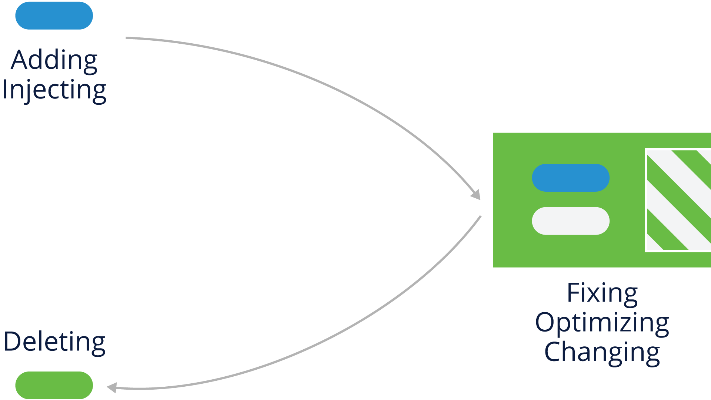

### Translation

A developer may transform the code from one state to another.

Examples include:

- Translating Chinese to English
- Converting C++ to Java
- Compiling into binary

### The Effect of Development Tools

In addition to human engineers performing some of these tasks, it's important to note for compliance purposes that some development tools also can perform these functions behind the scenes.

For example, a tool may inject portions of its own code into output of the tool.

### Compliance Considerations with Distribution

As mentioned earlier, it's important to consider how a particular open source component will be distributed, specifically:

- Who receives the software?
  - Customer/Partner
  - Community project
  - Another legal entity within the business group (this may count as distribution)
- What's the delivery format?
  - Source code delivery
  - Binary delivery
  - Pre-loaded onto hardware

### Lesson: Open Source Review Process

### Open Source Review Basics

After Program/Product Management and engineers have reviewed proposed Open Source components for usefulness and quality, a review of the rights and obligations associated with the use of the selected components should be initiated.

A key element to an Open Source Compliance Program is the _Open Source Review_ process. This process is where a company can analyze the Open Source software it uses and understand its rights and obligations.

The process includes the following steps:

- Gather relevant information
- Analyze and understand license obligations
- Provide guidance compatible with company policy and business objectives

### Initiating an Open Source Review

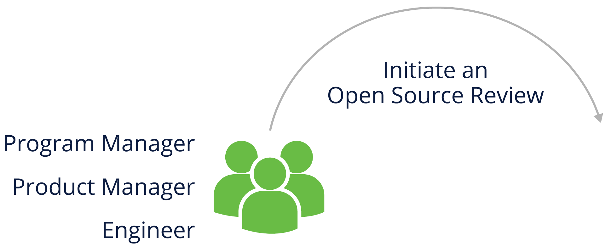

Anyone working with Open Source in the company should be able to initiate an Open Source Review, including Program or Product Managers, Engineers, and Legal team members

_Note: The process often starts when new Open Source-based software is selected by engineering or outside vendors._

### Gathering Component Information

When analyzing your open source usage, you'll need to gather information about the identity of the component in question, its origin, and how the component is intended to be used. This information may include:

- Package name
- Status of the community around the package (activity, diverse membership, responsiveness)
- Version
- Download or source code URL
- Copyright owner(s)
- License and License URL
- Attribution and other notices and URLs
- Description of modifications intended to be made
- List of dependencies
- Intended use in your product
- First product release that will include the package
- Location where the source code will be maintained
- Possible previous approvals in another context
- If from an external vendor:
  - Development team's point of contact
  - Copyright notices, attribution, source code for vendor modifications if needed to satisfy license obligations

### Open Source Review Team

Putting together a team to effectively run open source reviews requires participation from several stakeholders.

An Open Source Review team includes the company representatives that support, guide, coordinate and review the use of Open Source. These representatives may include:

- Legal to identify and evaluate license obligations
- Source code scanning and tooling support to help identify and track Open Source usage
- Engineering Specialists working with business interests, commercial licensing, export compliance, etc., who may be impacted by Open Source usage

### Analyzing Proposed Open Source Usage

The Open Source Review team should assess the information it has gathered before providing guidance for issues. This may include scanning the code to confirm the accuracy of the information.

Considerations include:

- Is the code and associated information complete, consistent and accurate?
- Does the declared license match what is in the code files?
- Does the license permit use with other components of the software?

### Source Code Scanning Tools

We will go into more detail in a later section on the different types of scanning tools and what criteria you should be considering for choosing a tool, but here is a general overview.

There are many different automated source code scanning tools, and all of the solutions address specific needs and - for that reason - none will solve all possible challenges. Because of that, most companies pick the solution most suited to their specific market area and product. In general, most companies try to use both an automated tool and manual review to spot check the results of scans.

One popular and good example of freely available source code scanning tool is [FOSSology](https://www.fossology.org/), a project hosted by the Linux Foundation.

### Working Through the Open Source Review

It's important to note that the Open Source Review process crosses disciplines, including engineering, business, and legal teams. For maximum effectiveness, It should be interactive to ensure all those groups correctly understand the issues and can create clear, shared guidance.

### Open Source Review Oversight

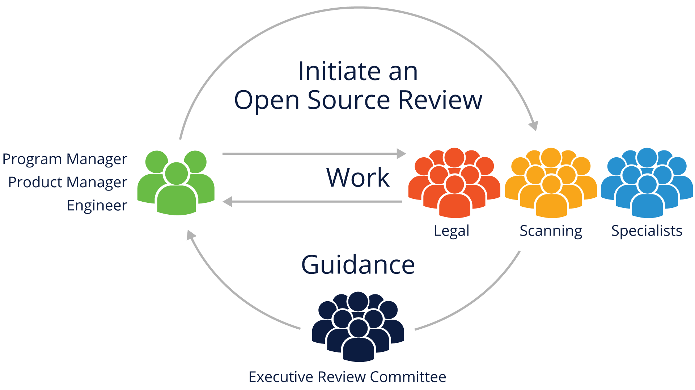

The Open Source Review process should have executive oversight to resolve disagreements and approve the most important decisions.

It's critical that the review process be treated as a cross-disciplinary activity in the organization, because simply characterizing it as "an engineering problem," or “a legal problem” not only diminishes the importance, but can have detrimental effects to both engineering productivity and legal risk.

Treating the process as a collaborative partnership does require more up-front work in getting all stakeholders on board, but pays dividends as your organization becomes more familiar with the end-to-end compliance management process.

### Lesson: End to End Compliance Management Examples

### Introduction

Compliance management is a set of actions that manages Open Source components used in products. Companies may have similar processes in place for proprietary components.

Such actions often include:

- Identifying all the Open Source components used in Supplied Software
- Identifying and tracking all obligations created by those components
- Confirming that all obligations have been or will be met
- Small companies may use a simple checklist and enterprises a detailed process.

### Example Company Checklist

Here is an example checklist that can be used as a basis for your own organization's compliance management process.

**Ongoing Compliance Tasks:**

- Discover all Open Source software components early in the procurement/development cycle
- Review and Approve all Open Source components used
- Verify the information necessary to satisfy Open Source obligations
- Review and approve any outbound contributions to Open Source projects

**Support Requirements:**

- Ensure adequate compliance staffing and designate clear lines of responsibility
- Adapt existing Business Processes to support the Open Source compliance program
- Have training on the organization's Open Source policy available to everyone
- Track progress of all Open Source compliance activities

### Example Enterprise Process

Here is a graphical overview of a typical enterprise compliance process for open source:

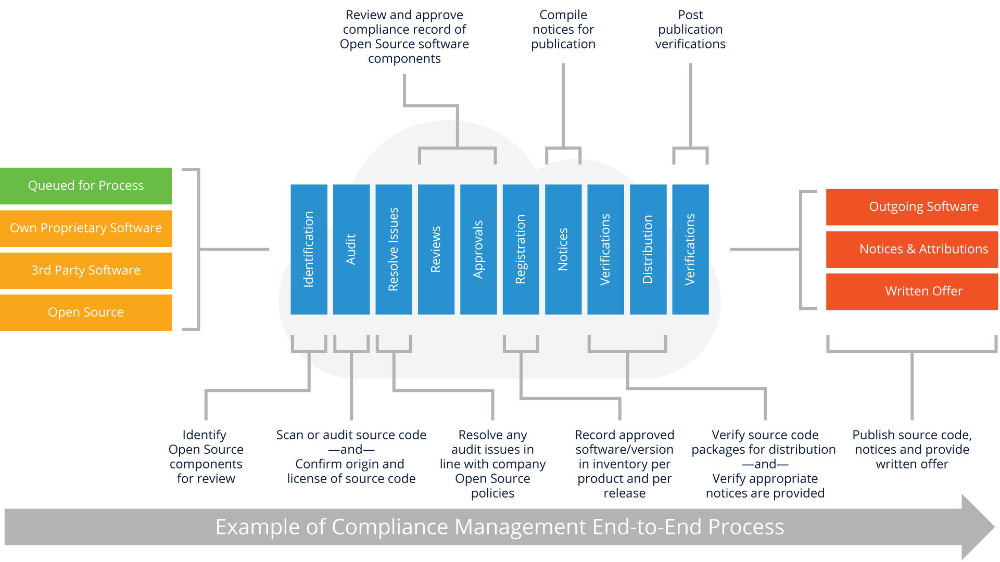

We'll go through the important sections of this process in the next several pages.

### Identify and Track Open Source Usage

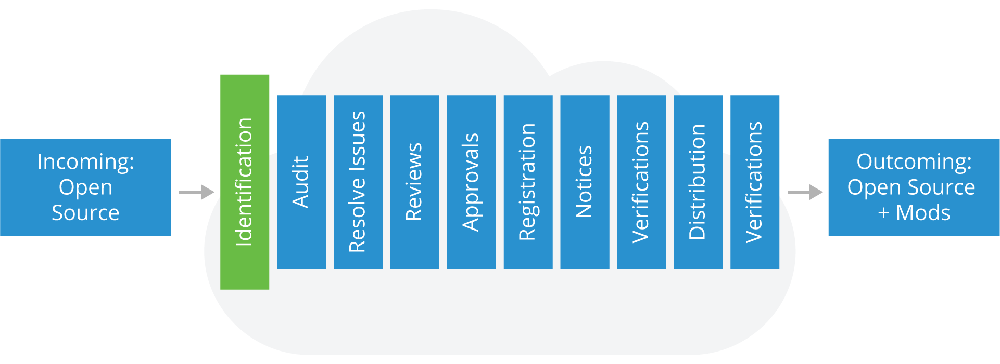

The first step in the process is identification of the open source components in your code.

Here are the steps and outcomes expected during this phase:

### Steps

- Incoming requests from engineering
- Scans of the software
- Due diligence of 3rd-party software
- Manual recognition of new components added to the repository

### Outcomes

- A compliance record is created (or updated) for the Open Source
- An audit is requested to review the source code with a scope defined as exhaustive or limited according to Open Source policy requirements

### Auditing Source Code

After identification, code auditing takes place, with the following steps and outcomes:

### Steps

- Source code for the audit is identified
- Source may be scanned by a software tool
- "Hits" from the audit or scan are reviewed and verified as to the proper origin of the code
- Audits or scans are performed iteratively based on the software development and release lifecycles

### Outcomes

- An audit report identifying:
  - The origins and licenses of the source code
  - Issues that need resolving

### Resolving Issues

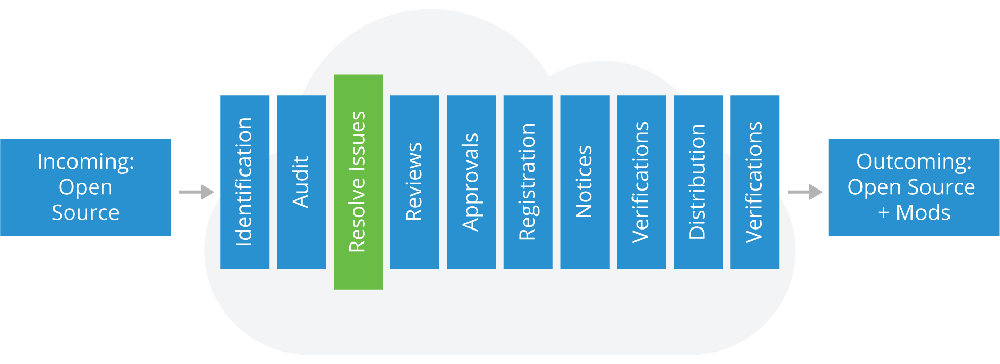

Once the audit is complete, time needs to be allocated to resolving any issues that were spotted as part of the audit process. Steps and Outcomes include:

### Steps

- Provide feedback to the appropriate engineers to resolve issues in the audit report that conflict with your Open Source policy
- The appropriate engineers then conduct Open Source Reviews on the relevant source code

### Outcomes

- A resolution for each of the flagged files in the report and a resolution for any flagged license conflict

### Performing Reviews

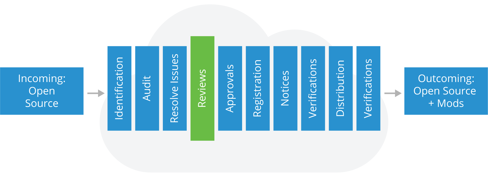

At this point, you'll need to review the resolved issues to verify that the resolution matches your corporate open source policy.

### Steps

- Include appropriate authority levels in review staff
- Conduct review with reference to your Open Source policy

### Outcomes

- Ensure the software in the audit report conforms with Open Source policies
- Preserve audit report findings and mark resolved issues as ready for the next step (i.e. Approval)

### Approvals

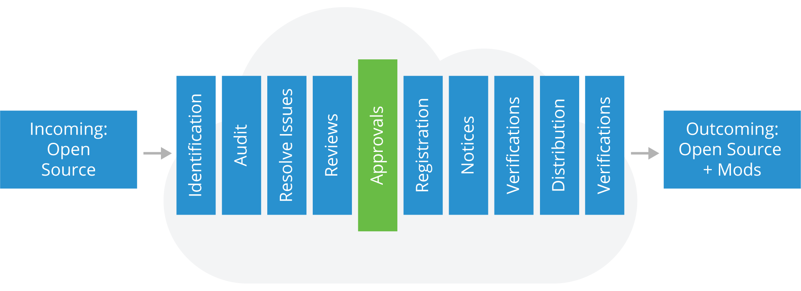

Based on the results of the software audit and review in previous steps, software may or may not be approved for use. The approval should specify versions of approved Open Source components, the approved usage model for the component, and any other applicable obligations under the Open Source license.

Also, approvals should be made at appropriate authority levels (up to and including the executive review committee if necessary).

### Registration & Approval Tracking

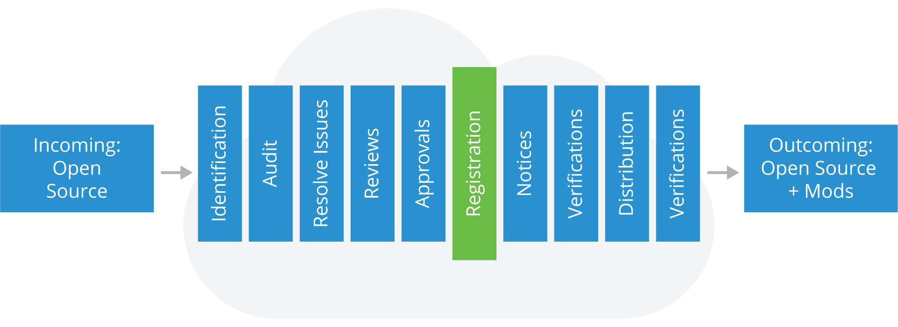

Once an Open Source component has been approved for usage in a product, it should be added to the software inventory for that product and the approval and its conditions should be registered in a tracking system.

The tracking system should make it clear that a new approval is needed for a new version of an Open Source component or if a new usage model is proposed.

### Notices

After registration, you'll need to prepare appropriate notices for any Open Source used in a product release:

- Acknowledge the use of Open Source by providing full copyright and attribution notices
- Inform the end user of the product on how to obtain a copy of the Open Source source code (when applicable, for example in the case of GPL and LGPL)
- Reproduce the entire text of the license agreements for the Open Source code included in the product as needed

### Pre-distribution Verifications

Prior to any software distribution, you'll need to run a series of verifications steps including:

### Steps

- Verify Open Source packages destined for distribution have been identified and approved
- Verify the reviewed source code matches the binary equivalents shipping in the product
- Verify all appropriate notices have been included to inform end-users of their right to request source code for identified Open Source
- Verify compliance with other identified obligations

### Outcomes

- The distribution package contains only software that has been reviewed and approved
- "Distributed Compliance Artifacts" (as defined in the OpenChain specification), including appropriate notice files are included in the distribution package or other delivery method

### Accompanying Source Code Distributions

At this stage of the process, you're ready to provide the accompanying source code to meet any license obligations specified by the license of the open source code used. You'll need to make sure to:

- Provide accompanying source code along with any associated build tools and documentation (e.g., by uploading to a distribution website or including in the distribution package)
- Identify accompanying source code with labels for which product and version it corresponds to

### Final Verifications

In this final verification step, you'll need to validate that you've complied with all appropriate license obligations by:

- Verifying accompanying source code (if any) has been uploaded or distributed correctly
- Verifying uploaded or distributed source code corresponds to the same version that was approved
- Verifying notices have been properly published and made available
- Verifying other identified obligations are met

# Section: Choosing the Right License Compliance Tool

## Lesson: Introduction

### Section Overview

In this section, we will look in more detail at license compliance tooling, including providing context around what kinds of problems tooling will solve and what kinds of criteria you should be considering as you determine the best compliance tooling and scanning software for your organization.

### Learning Objectives

By the end of this section, you should be able to:

- Describe the overall compliance tool landscape and appropriate tool use cases
- Explain the different kinds of compliance tools that are available
- Know where to go for more in-depth information on different kinds of compliance tools

## Lesson: Tooling Use Cases

### Introduction

As you've undoubtedly determined from the content in this module to this point, conceptually, compliance is fairly straightforward. The challenge comes in the form of the amount of software that's available to use in the open source world and the variety of ways in which it can be combined with your own organization's software.

Tracking and building an effective compliance process therefore requires tooling in various forms to help alleviate possible human error and speed up the process of achieving compliance. However, there are some important things to consider as you think about possible tooling:

- First understand the demand and process, then determine the tool
- A tool cannot provide (difficult) decisions, but only data for those decisions
- There will be many cases where expert knowledge is required, even with tooling

### About Tools

<!-- 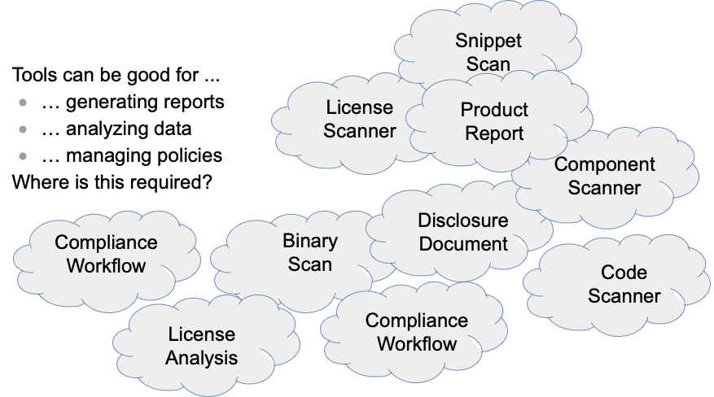 -->

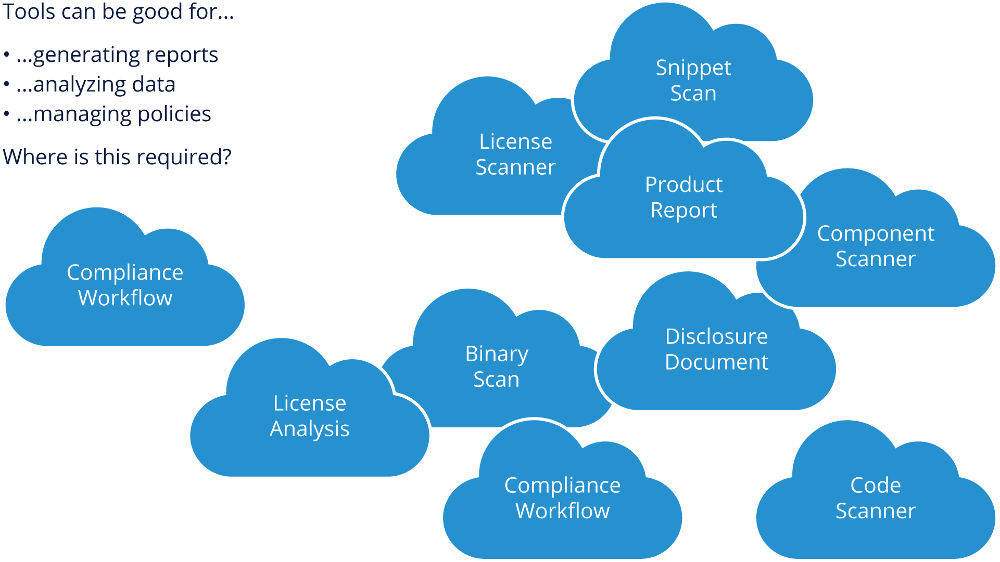

As you can see, there are many different areas of compliance where tooling can be put to use. However, resist the urge to build all of this tooling as a monolithic stack. Determining what your biggest potential pain points are gives you the opportunity to build out tools in an open source/agile style (e.g. - in an iterative fashion as your compliance needs grow).

### Software Situation

As you think about tooling, it's important to consider the different categories of software and situations you'll be addressing. As noted above, you basically have three categories: Inbound, Your Own, and Outbound software to consider.

### Compliance Tooling Cases from 10k Feet

At a high level, you need to consider the cases noted above and what's required as you think about your tooling needs.

For Inbound software, it's critical that you document the actual situation (license type, obligations, etc.). For your own software, you need to exercise quality control in terms of understanding how and why you are linking to or calling open source packages. For the combined Outbound software, you need to understand what your deliverable looks like in the combined package of your software and the open source component and make sure you are abiding by all license obligations related to distribution.

### Analyzing Inbound Software

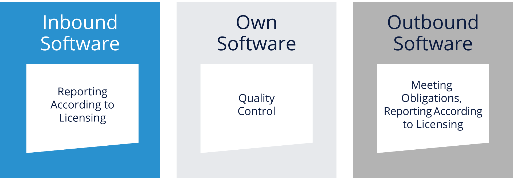

There are several areas to consider as you analyze inbound software, not the least of which is that even inbound commercial software can itself contain open source (part of their distribution). It's also important to think about:

- Identifying which open source components are involved
- Identifying licenses associated with open source components
- Identifying authorships and copyrights
- Determining licensing obligations
- Declaration of imports, dependencies, used libraries, etc.
- Origin and contents of any binaries included with the software

### Identifying Inbound Licenses

Figuring out the licenses for inbound software can be relatively easy, or potentially very challenging. It's one of the reasons that tools can help a great deal. Here are some details on the easy cases and the more challenging ones.

### Easy Cases

- License, copying or notice document provided along with software
- Within infrastructure, home page or project pages
  - e.g. Github or other repository metadata
- Project definition file
  - e.g. in Java pom.xml
- Already provided license info
  - e.g debian-copyright or machine-readable documentation

### Challenging Cases

- License proliferation with over 350 "main" licenses in existence (with more cropping up)
- Licenses in different languages (e.g. the French CeCILL)
- Commercial licenses such as an EULA (End User License Agreement) lack standardization
- Open source components are not (always) homogeneous because of extensive reuse
- Code can come from many sources with different licensing
- Projects may not enforce common licensing for all contributions
- Identifying license statements can be challenging because of no standard format

### Identifying Copyright

Some licenses ask for copyright notice or author listing, resulting in an obligation to provide these, but as you can see below, sometimes parsing and untangling copyright notices can be problematic, so this is usually where software (and projects like SPDX, which we'll cover a bit more later) come in.

### Identifying Licenses with Binaries

Binaries are compiled applications, libraries, software that can be used without access to source code. Binaries can be part of an open source component distribution and can themselves contain open source.

The main issues here revolve around how to understand what is contained in a binary:

- Main problem 1: different binary technologies and hardware architectures
- Main problem 2: small variations in source can generate a completely new binary

### Your Own Software

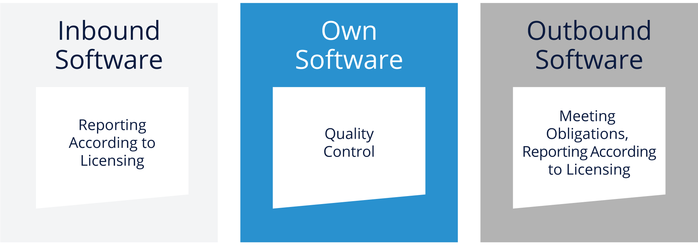

While it is hoped that your organization will practice good coding and engineering habits, there is always a temptation for "copy & paste" solutions to make their way into your code base. There are many reasons for this including:

- Open source projects are publicly available
- But also other files are valuable: scripts, icons, images, css files
- Small sections of code copied from Web sites for best practices and snippets is easier

Copying and paste of source code from the Internet in your code can be done, as reuse is generally better than reinventing the wheel each time. However, it's important to respect the author's interests by observing any licensing or copyright obligations.

### Outbound Software

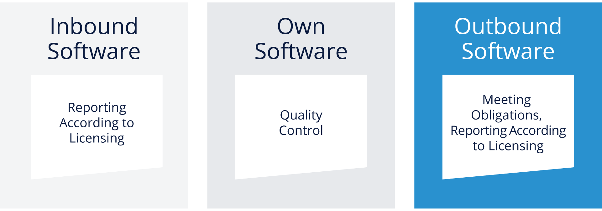

When you begin to package your product for sale or distribution, you'll need to focus on what the combined outbound software stack looks like in the context of open source compliance, as well as other ancillary tasks. We'll cover these items in the following pages.

### Distribution of Open Source

If your project or product will be distributing open source as part of your deliverable, you'll need:

- A notice file, consisting of
  - A listing of all licenses
  - A listing of all copyright notice
- A written offer to provide the open source code

To be able to provide all of this, you'll need tooling which gathers the following information:

- Which open source components are in your software
- Which licenses and copyright notices are attached to those components

### Ensuring Distribution Rights

Since your goal with compliance is to ensure that you are meeting all appropriate obligations for the open source code you use, you'll need to consider both tooling **and** human review of licenses in your outbound software.

For example, some licenses are not compatible, such as the GNU Public License (GPL) and the Eclipse Public License (EPL), and works based on code containing GPL and EPL licenses can be problematic.

In addition, even with tooling, some license statements are ambiguous, for example "Licensed under BSD". In cases like this, it's important to involve your legal team and stakeholders in determining how to proceed.

### Software Bill of Materials (SBOM)

One of the most critical things that code scanning or compliance tooling can provide is a programmatic way of determining what is in the software or product that you are shipping. This is in the form of a Software Bill of Materials (SBOM).

An SBOM provides a detailed account of what is in a software package delivery, including identifying how much of that software package consists of open source components and which licenses are in use for those components.

The [Software Package Data Exchange (SPDX)](https://spdx.org) project specifies one implementation of how to express a Software Bill of Materials.

### Tool Support Summary

We will cover different types of tooling in our next section, but it's important to understand what tools can provide in compliance, and also what areas need to be considered before choosing a solution.

As you can see from this section, there are several things that are needed in building effective compliance, and tooling is by no means a "silver bullet" that will make all compliance burdens go away. Tools are very good at analysis, reporting and helping drive management decisions, but they cannot operate in isolation - they need an effective process, married to a clear set of expectations and policies for consuming open source, as well as distributing your own software which builds upon open source packages.

Remember that there also isn't necessarily a single tool that meets all needs, so you will likely be dealing with integration of different systems/tools, and you should have a clear understanding of what APIs and interfaces the tools provide in order to reduce manual integration effort.

## Lesson: Tooling Types

### Overview

There are many types of tools in the open source compliance space, including (but not limited to):

- Source code scanning
- License scanning
- Binary scanning
- DevOps integration
- Component management

We'll cover each of these areas in the following pages.

### Source Code Scanning

Since organizations have access to their own source code, as well as the open source packages used to build their products, source code scanning tools are some of the most widely used tools in compliance.

There are many commercial tools (and some open source ones) available that perform this function. In general, these tools rely on "hashing" fingerprints of existing open source code bases (or, potentially internal components if added to the scanning database) to make a determination of what software components are part of a distribution. One of their biggest advantages is in building the Software Bill of Materials (SBOM) we mentioned earlier.

Some scanning tools can also identify "code snippets", which is often helpful when determining if "copy and pasted" code from a particular open source package was used. However, snippet scanning comes at a price - it will often take longer to run a full snippet scan analysis on source code rather than just relying on hashed fingerprints.

The biggest differentiator for many of these tools is their data sources - how often their databases are updated, and how much open source code is represented in their data. Cost, complexity, integration ability for your build environment, and reporting features are also key features you'll need to evaluate before making a tool selection.

There is also the possibility of "false positives" or cases where expert knowledge may need to be brought in (legal, engineering) to determine the relevance of results from source code scanning.

### License Scanning

While we are covering license scanning tools as a separate item, in practice, most commercial source code scanning tools also include license scanning capabilities.

License scanning relies on searching source code for relevant keywords, and/or machine readable markers (such as SPDX blocks) to determine the relevant licenses attached to each file or package. These scans can also identify copyright, author statements and sometimes acknowledgements.

While the database of open source licenses isn't as large as the database of open source components required to build a component identification piece in the SBOM, it still does require access to a knowledge base of existing open source licenses. In general, license scanning has a harder time identifying non-OSS licenses, as there are a larger variety of these types of licenses.

As noted earlier, a primary use of license scanning is when checking inbound open source software to verify the license in use. This is often one of the first steps performed (after evaluation for fitness of technical purpose) before validating an open source component for use in your organization.

Even with the best pattern matching or utilization of machine-readable markers, there may be cases where legal or engineering stakeholders need to be utilized to clarify a license identification that may be ambiguous.

### Binary Scanning

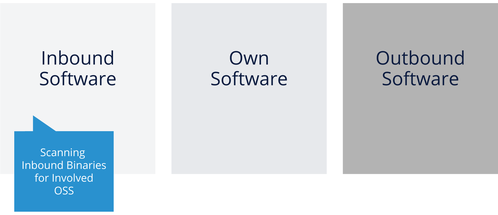

The purpose of binary scanning is similar to source code scanning (identification of open source components and their versions), which can help with SBOM creation, as well as identification of potential vulnerabilities for specific software packages coming into your organization.

The challenge here, of course, is that without readable source code, binary scanning is a heuristic that relies on some characteristic elements of binaries, such as string variables, filenames and sometimes method and field names from languages with run-time code available (e.g. Java). Because hardware architectures and compilers can change over time, binary scanners have to be frequently adjusted to try and account for these changes.

There are also some cases where a reliable scan isn't fully available for a particular binary. But, it's still a good idea to scan binaries if you can in an attempt to identify open source in packages that you don't have the source code for.

### DevOps Integration

DevOps integration using custom-built software and custom processes can be used to augment other previously mentioned scanning mechanisms and gain additional information from the processes used to build the software.

Because the DevOps build system is able to determine dependencies during builds, it can combine that information with the output of other tools to help create a more robust SBOM. This is especially true of development organizations that may have intricate dependencies, or legacy packages in their software that are unlikely to be identified correctly by commercial or open source scanning technologies.

The one downside is that these custom configurations/systems do require effort to build and maintain, but if your organization already has a build system tied to a DevOps infrastructure, integrating outside scanning tools into this environment may be possible and may help alleviate a fair amount of manual review/compliance work.

### Component Management

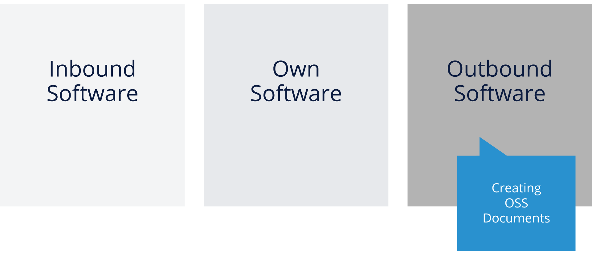

A handy compliance tool to help you bring together your various associated Software Bill of Materials (SBOMs) and provide documentation and reporting is a Component Management System. There are various commercial vendors and some open source projects (search [github.com](https://github.com/)) that provide this kind of functionality.

Some organizations even choose to write this kind of database program for themselves, but the important thing is that it can help with a variety of things, including vulnerability management, approval of open source components, tracking of licenses, and identification of which open source components are used throughout all of the software in an organization.

Implementing this as a web portal can help multiple stakeholders, especially legal, security, and even engineering teams when they have to address questions of license compliance, security vulnerabilities, or tracking versions of open source components in use in the organization.

## Lesson: Industry Initiatives for Compliance Tooling

### Overview

There are a host of industry initiatives that have sprung up around compliance tooling, including [FOSSology](https://www.fossology.org/) for scanning, Microsoft's [ClearlyDefined](https://clearlydefined.io/) and [tl;dr Legal](https://tldrlegal.com/) for license clarification and review, and many others.

In the next two pages, we'll highlight two initiatives that are important for automation and supply chain efforts to help make open source more sustainable and easily consumed in organizations - SPDX and OpenChain.

### SPDX

[Software Package Data Exchange (SPDX)](https://spdx.org) is a project, a standard, and a set of license data that helps enable machine (and human) readable license information to be embedded in source code, but also exchanged between different compliance tools and systems.

SPDX is also a meritocratic community workgroup developing a set of collateral that can be used to more clearly convey complete license information in a standard/reusable fashion and to facilitate compliance. The advantages of this are:

- Establishing a common data format (SPDX Documents) allows less redundant effort to be expended on license compliance. License compliance can only begin once all software and associated licenses have been identified in a particular code base.
- The content of an SPDX document typically comprises information definitively identifying the software package, package level, and file level licensing and copyright information. It also provides metadata about the analysis itself: who created the file, when, and how.
- Standard formats allow for tooling to be created to make the process more efficient and to allow more complex compliance operations to take place.

The last point here is probably the most important in the context of our tooling discussion so far - for commercial, open source, or custom-built compliance tools, the ability to have a standard format to exchange license data is absolutely critical - without that, there would be a lot of manual effort and review to maintain effective open source compliance.

### OpenChain

The [OpenChain Project](https://www.openchainproject.org/) ISO 5230 is the International Standard for the key requirements of a quality open source compliance program. The project provides a specification and certification program regarding supply chain exchanges of source code, build scripts, license copies, attribution notices, modifications notices, SPDX data and other materials open source licenses governing a software deliverable may require.

Additionally, the project provides a set of curriculum, as well as a free [assessment tool](https://www.openchainproject.org/get-started/conformance) that can help your organization determine what areas can be improved to help your own open source compliance.

Perhaps most important of all, OpenChain is a growing [community](https://www.openchainproject.org/webinars-interviews) of people who are a great resource for organizations just starting on their journey in open source compliance.

# Section: The Role of Open Source Audits During M&A Activities

## Lesson: Introduction

### Section Overview

In this section, we will provide an explanation of the role that open source audits play when Mergers & Acquisitions (M&A) activities bring in new code to your existing products. Effective audits can help with both legal compliance as well as be a strategic means to identify areas for software reuse.

### Learning Objectives

By the end of this section, you should be able to:

- Describe the most commonly used audit methods for open source compliance
- Explain how to prepare for an audit as either the acquiring target, or the acquiring company

## Lesson: Overview

### Introduction

We've already established that software, and specifically open source software, plays a big role in not only technology companies, but many companies that previously weren't in the software or technology business. So far in this module, we've covered the details of what it means to build an effective compliance process for Inbound Software, Your Own Software, and Outbound Software.

A special case for Inbound Software occurs when an organization is about to acquire the intellectual property (in software) of another company. This software due diligence process, in which the acquirer performs a comprehensive review of the target's software and their compliance practices, is becoming a standard part of any merger or acquisition. During this process it's common to encounter open source software, which presents a set of verification challenges different from proprietary software.

In the rest of this section, we'll provide an overview of the open source audit process in merger and acquisition (M&A) transactions.

**Why Conduct an Audit?**

While every M&A transaction is different, the need to verify the impact of acquiring open source obligations is a constant. Open source audits are carried out to understand the depth of use and the reliance on open source software. Additionally, they offer great insights about any compliance issues and even about the target's engineering practices.

Examples of ways open source software can impact the acquired assets include:

- Any software licensed under the GNU General Public License (GNU GPL), requires derivatives or combinations to be made available under the same license as well, which could affect any proprietary code that is using the open source code.
- Other licenses require certain notices in documentation or have restrictions for how the product is promoted.
- Failure to satisfy open source license obligations can lead to possible litigation, expensive re-engineering, product recalls, and bad publicity.

A common question is whether an open source audit is needed at all. The answer differs by company, purpose of acquisition, and size of the source code base. For instance, for small acquisitions, some companies prefer to just review the open source bill of materials (BOM)
provided by the acquiring target (assuming it is available) and have a discussion with their engineering lead about their open source practices. Even if the purpose of the acquisition is to acquire the talent, an audit can help uncover whether there are undisclosed liabilities due to historical license obligations from products which have already shipped.

**Inputs & Outputs**

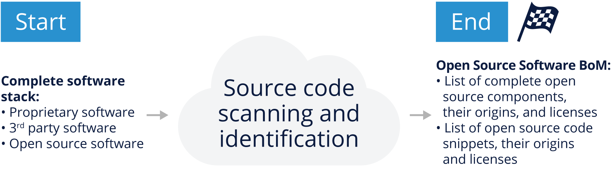

The audit process has one primary input and one primary output (see figure above). The input to the process is the complete software stack subject of the M&A transaction being conducted. This includes proprietary, open source and 3rd party software.

On the end side of the process, the primary output is a detailed open source software bill of materials that lists:

- All open source software used as components, their origin and confirmed licenses
- All open source snippets used in either proprietary or third-party software, their originating components, and confirmed licenses
- All 3rd party software components and snippet without any license
- (All 3rd party commercial software components and snippets)

**Assessing the Scope of an Audit**

The size, scope, and cost of an audit varies by transaction, and generally increases with source code size and complexity. To determine the cost and time for an open source audit, auditors need to get some basic understanding of the size and characteristics of the code base, as well as the urgency of the project.

The first questions will be related to code metrics, such as the size of the source code base, the number of lines of source code, and the number of files that need to be audited. Auditors also ask if the codebase consists exclusively of source code, or if it includes binary files, configuration files, documentation, and possibly other file formats. Sometimes, it is also helpful for the auditor to know the file extensions subject to the audit. As we've already learned in this module, understanding these things will help the team pick the right tools to support the audit.

Because audit price discussions happen early in the process based on size and scope, the acquirer may not have access to all the information described above. At minimum, the auditor needs to understand the number of files to be scanned before proceeding, although additional information will help refine the estimates. When the auditor has enough information to understand the scope of the work, they will also need to understand the urgency, as this has a significant impact on the cost of an audit.

## Lesson: Audit Methods

**Overview**

Depending on what the auditors find during the initial acquisition discussion phase, they may have to rely on several types of tools (scanning, license identification, component management) to perform the audits.

There are two audit methods:

1. Traditional audit, in which the auditor gets complete access to all the code and executes the audit either remotely or on site.
2. "Do It Yourself" audit, where the target company or the acquirer performs most of the actual audit work themselves using the tools with the option for a random verification of results from the auditing company.

**Traditional Audit**

This method is called traditional, because it's the original method of source code scanning for open source compliance purposes. Traditional audits are those where a compliance auditor from a third-party auditing company gets access to the source remotely via a cloud system or physically while visiting on site and performs the source code scan.

Please note that the process may vary slightly from one service provider to another. A typical traditional audit process follows these steps:

- Auditor sends questions to the acquirer to have a better understanding of the job.
- Acquirer responds, allowing the auditor to have a better understanding of the scope and audit parameters.
- Auditor provides a quote based upon the responses.
- Agreement is reached on the quote. Next is signing the service agreement, statement of work, non-disclosure agreement, etc. (Please note that "Start" in all figures assumes an actual start of the audit process when all agreements have been signed.)
- Auditor is granted access to the target's code via secure cloud upload, or through a visit to the company for an on-site audit.
- Auditor scans the target's source code, cleans up any false positives, and evaluates the results.
- Auditor generates the report and delivers it to the client.
- A call or a face-to-face meeting follows to review the results with the auditor and address any questions.

This method is common across most audit service providers, and it allows the opportunity to collect multiple bids for the same audit job and the ability to choose the best bid given your requirements.

For this model to work, the target company must be willing to transfer the code to the auditors or allow them to visit their offices to complete the job on-site.

**Do-It-Yourself (DIY) Audit**

<!--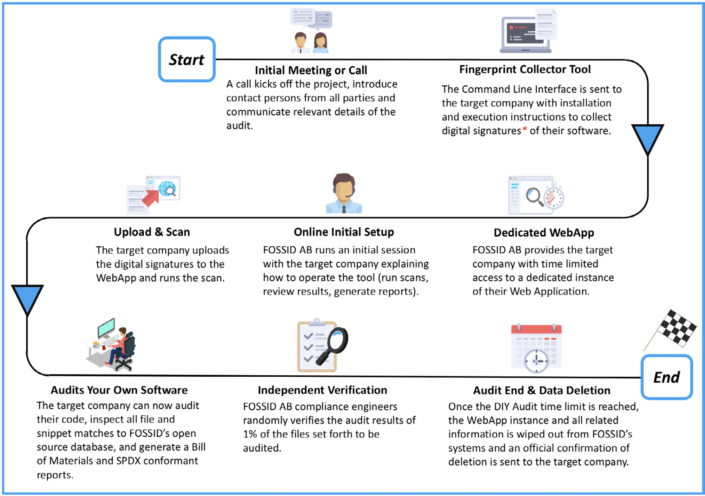-->

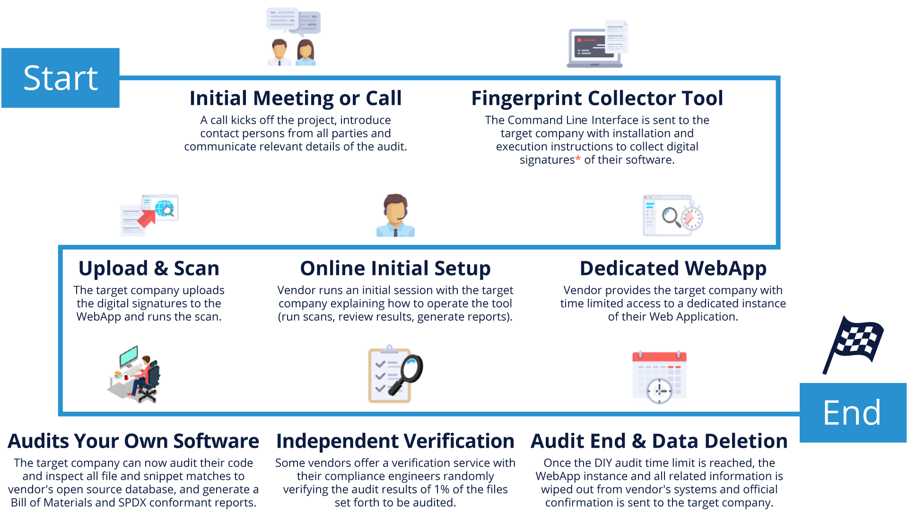

The Do-It-Yourself (DIY) audit provides the acquirer or the target company time-limited access to the compliance cloud tools, enabling them to run the scan themselves. They can then perform the audits internally with complete access to the knowledge base and all reporting facilities.

This is an approach that is particularly interesting for companies that have in-house employees with sufficient experience to interpret scan results and suggest remediation procedures. It can quickly become more cost-effective for companies that go through the M&A process several times per year. An independent certification can be performed by the auditing tools service provider to verify the findings, to further secure the integrity of the audit.

This approach has several advantages, such as the ability to start the audit as soon as it's needed because it uses internal resources and is not dependent on the availability of third-party auditors. This approach potentially shortens the timeline and reduces an external source of cost.

Any compliance problem can be addressed immediately, because it is conducted by the people who have direct access to the code and can apply fixes directly. Finally, the audit can be verified by the provider of the audit tool to ensure correctness and completeness.

**Final Audit Report Notes**

Many auditing tools can also be tuned to highlight potential issues. After viewing the results carefully, you might find many of the results to be non-issues, but you should expect the potential for a lot of "noise" in the initial reports.

The noise may come from things like leftover code that is in the code tree but not used. Therefore, the initial report may be lengthy, and you should be prepared to invest time to filter the report to find the real issues.

Note that a Software Package Data Exchange (SPDX) conformant report is usually provided on demand. Therefore, if you would like your audit service provider to provide such a report, you will need to request it, and if you've already invested in SPDX-compatible tooling, this will make importing and tracking your audit results much easier.

**Pre and Post Acquisition Remediation**

By this point, the acquiring company should have a clear idea how the target uses and manages open source software and how successful they've been at satisfying their open source license obligations. The acquirer and target should use this information to negotiate remediation for any open source compliance issues.

If any issues are uncovered in the audit, there are a few options for resolving them as a part of the pending transaction. The first option is to simply remove any offending code. If the open source software only augments proprietary code, it may be possible to eliminate it entirely. Another option is to design around the offending component, or rewrite any code using cleanroom techniques.

If the section of code is truly essential or if it has been previously distributed, the only remaining option is to bring the code into compliance. The cost of each option can be used when determining the valuation of the target. Whatever option is chosen, it's crucial to identify the individuals who participated in incorporating the open source code, and to get them involved in the remediation effort. They might have additional documentation or knowledge that can be useful in resolving issues.

## Lesson: Preparing for an Audit as The Acquiring Company

**Think About Your Needs**

As an acquirer, you must take action and make decisions before the audit is commissioned and you have additional obligations after you receive the results. Therefore, it's important that you consider your needs, as well as which of the audit methods mentioned earlier would work best for your organization and particular situation.

It's equally important that you determine what you most care about as an organization in terms of audit results. The report from the source code audit may provide a significant amount of information, depending on the complexity of the scanned code. Therefore, it's important to identify which licenses and use-cases are regarded as critical ahead of getting the results.

Being clear about your needs both before and after the audit will not only make the audit process smoother, but also more cost-efficient in the long run.

**Ask the Right Questions**

The open source audit report offers a lot of information about the target's source code and the licenses involved. However, many other data points will require further investigation in order to clarify or confirm compliance-related concerns. In this section, we offer a collection of questions as a starting point to frame what is important to you, and what questions you should address with the target company.

- Has the target used code with licenses that could jeopardize the IP of the target or acquirer?
- Are there any code snippets with unknown origin and/or unknown license?
- Are the target's open source compliance practices sufficiently mature and comprehensive?
- Does the target company track known vulnerabilities in their open source components?
- When distributing products, does the target provide all necessary materials to satisfy open source license obligations (written offer, various required notices, and source code when applicable)?
- Does the target company's compliance process align with the speed of development to meet product release schedules?
- Does the target have a process in place to respond to requests for source code in a timely manner?

**Identify Items to be Resolved**

In some cases, an open source audit may reveal instances of licenses or compliance practices that are not acceptable to the acquirer. The acquirer can then request these instances to be mitigated as a condition for closing the transaction.

For instance, the target company may use a code component that uses License A, but the acquiring company has a strict policy against using any source code licensed under License A.

In such a situation, both parties will need to discuss and figure out a possible solution.

**Create a Post-acquisition Compliance Improvement Plan**

Creating a compliance improvement plan is especially important when the acquirer is a large company buying a smaller startup that will continue to operate as a subsidiary. In this scenario, the acquirer often helps the target establish a formal compliance policy and process, provides training on their own practices, and offers ongoing guidance and support.

There may also be an opportunity to assist the acquisition with improved tooling/processes and/or staffing.

## Lesson: Preparing for an Audit as An Acquisition Target

**Be Prepared**

Passing an open source compliance audit is not hard if you're prepared. However, it is very unlikely to happen if you begin preparing only once an acquirer shows interest. These activities are meant to go hand-in-hand with your daily business and development activities. The objective is to ensure the company tracks all open source components and respects open source license obligations resulting from use of open source components. These same measures can be of great help if your company becomes a target for a corporate transaction, as they minimize the risk of surprises.

As you'll see in the next few chapters, these practices are consistent with what we've learned to this point in this module.

**Know What's In Your Code**

Knowing what's in your code is the golden rule of compliance. You need to maintain a complete software inventory for all software components including their origin and license information. This covers software components created by your organization, open source components, and components originating from third parties. The most important point is having a process for identifying and tracking open source components. You don't always need a complex compliance program, however, you should have five basic elements: policy, process, staff, training, and tools.

**Policy and Process**

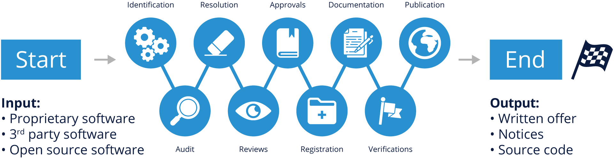

This figure restates some of what we've already covered, but it's important to revisit it here.

The open source compliance policy is a set of rules that govern the management of open source software (both use of and contribution to). Processes are detailed specifications as to how a company will implement these rules on a daily basis. Compliance policies and processes govern various aspects of using, contributing, auditing, and distribution of open source software.

This figure illustrates a sample compliance process, with the various steps each software component will go through as part of the due diligence as you build your product or software stack.

1. Identify all incoming source code
2. Audit source code
3. Resolve any issues uncovered by the audit
4. Complete appropriate reviews
5. Receive approval to use open source
6. Register open source in the software inventory
7. Update product documentation to reflect open source usage
8. Perform verification to all steps previous to distribution
9. Distribute source code and perform final verifications in relation to distribution

The output of the process is an open source BoM that you can publish, along with a written offer and various copyright, license and attributions notices fulfilling the legal obligations of the components in your BoM.

For a detailed discussion on the open source compliance process, please download the free e-book [_Open Source Compliance in the Enterprise_](https://www.linuxfoundation.org/resources/publications/open-source-compliance-in-the-enterprise/), published by The Linux Foundation.

**Staff**

In large enterprises, the open source compliance team is a cross-disciplinary group consisting of various individuals tasked with the mission of ensuring open source compliance. The core team, often called the Open Source Review Board (OSRB), consists of representatives from engineering and product teams, one or more legal counsel, and a compliance officer.

The extended team consists of various individuals across multiple departments that contribute on an ongoing basis to the compliance efforts: Documentation, Supply Chain, Corporate Development, IT, and Localization. However, in smaller companies or startups, this can be as simple as an engineering manager supported with a legal counsel.

**Training**

Education is an essential building block in a compliance program, to help ensure that employees possess a good understanding of policies governing the use of open source software. The goal of providing open source and compliance training is to raise awareness of open source policies and strategies, and to build a common understanding of the issues and facts of open source licensing. It should also cover the business and legal risks of incorporating open source software in products and/or software portfolios.

Both formal and informal training methods are available. Formal methods include instructor-led training courses where employees have to pass a knowledge exam to pass the course. Informal methods include webinars, brown bag seminars, and presentations to new hires as part of the new employee orientation session.

**Tooling**

As you've already learned so far in this module, there are many different types of tools and can be utilized in the compliance process. An important thing to remember is that the tools are no substitute for good process, and knowledgeable staff making decisions based on policies and the data provided by the tools.

It's also important to consider taking an "open source" approach to your tooling as well - continual evaluation of the tools in place, and the ability to pivot when necessary is critical to maintain a healthy compliance program.

**Be in Compliance**

If you have shipped products containing open source software—whether intentionally or not—you will need to comply with the various licenses governing those software components. Hence the importance of knowing what's in your code, because a complete bill of materials makes compliance much easier.

Being in compliance is not a simple task, and it varies from product to product based upon the licenses and the structure of the code. At a high level, being in compliance means that you:

1. Track all use of open source software.
2. Compile a finalized open source BoM for all software in the shipping image of products.
3. Fulfill the obligations of the open source licenses.
4. Repeat the process every time you issue a software update.
5. Respond quickly and seriously to compliance inquiries.

**Keep Up with Latest Release for Security**

One of the benefits of a comprehensive compliance program is that it's easier to find products with insecure versions of open source components and replace them. Most source code scanning tools now provide functionality to flag security vulnerabilities disclosed in older software components.

One important consideration when upgrading an open source component is to always ensure that the component retains the same license as the previous version. Open source projects have occasionally changed licenses on major releases. Companies are encouraged to engage with open source project communities to help avoid situations where they are using a version with security vulnerabilities.

It is not reasonable or feasible to be active in all of the open source projects you use, therefore a certain level of prioritization is needed to identify the most critical components. The various levels of engagement range from joining mailing lists and participating in the technical discussions, to contributing bug fixes and small features, to making major contributions. At minimum, it is beneficial for corporate developers working on a specific open source project to subscribe to and monitor the mailing list for reports related to security vulnerabilities and available fixes.

**Measure Your Compliance Efforts**

The easiest and most effective first step for organizations of all sizes is to engage with the OpenChain Project (mentioned earlier) and to obtain "OpenChain Conformant" status. This is done by filling out a series of questions either [online](https://certification.openchainproject.org/) or manually.

The questions used for OpenChain Conformance help to confirm that an organization has created processes or policies for open source software compliance. OpenChain is an industry standard, similar to ISO 9001. It is focused on the "big picture," with precise processes and policy implementations up to each individual organization.

OpenChain Conformance shows that open source compliance processes or policies exist, and that further details can be shared when requested by a supplier or customer. OpenChain is designed to build trust between organizations across the global supply chain.

**Conclusion**

Open source due diligence is generally one item in a long list of tasks that need to be successfully completed in an M&A transaction. However, it is still an important aspect of the general due diligence exercise given the central role of software and potential IP risks.

Although open source due diligence may seem like a lengthy process, it often can be completed quickly, especially if both parties are prepared, and working with a swift compliance service provider.

**How can you be prepared?**

If you are the target, you can maintain proper open source compliance practices by ensuring your development and business processes include:

- Identifying the origin and license of all internal and external software.
- Tracking open source software within the development process (components and snippets).
- Performing source code reviews for new or updated code entering the build.
- Fulfilling license obligations when a product ships or when software is updated.
- Offering open source compliance training to employees.

If you are the acquirer, you should know what to look for and have the skills on-hand to address issues quickly:

- Decide with the target company on the appropriate audit method to use, and which third party to engage for the audit.
- Note that some don't have ability to do blind testing, some do not support the DIY, and others do not have the ability to discover code snippets.
- If possible, get multiple bids for the audit and learn more about your audit service providers. This step is not just about the cost, but about having the precise output to help you address any concerns you may have. Make sure you have the internal expertise to compare each bid equally and that they include all audit parameters, such as:
  - Audit method, inputs and outputs
  - Primary contact persons at target and acquirer for speedy discussions of issues that arise
  - Timeline and logistics especially if it involves an on-site visit
  - Confidentiality parameters
  - Code vulnerabilities and version control analysis
  - Cost, normal process and expedited

Open source compliance is an ongoing process. Maintaining good open source compliance practices enables companies to be prepared for any scenario where software changes hands, from a possible acquisition, a sale, or product or service release. For this reason, companies are highly encouraged to invest in building and improving upon their open source compliance programs.
